# WOOOD App – Changelog

## Plan: Run features inside the app using app auth/context and `shopify.webhooks.tsx`

Goal: Move feature execution from Worker-only endpoints to app routes that use the existing `createShopify(context)` auth and app structure. Trigger actions from Polaris UI elements/buttons and keep webhook intake on the app route.

Scope

- Replace Worker-facing APIs with app routes/actions wherever feasible
- Reuse the current util modules as pure helpers (no direct env token access)
- Persist shop state via KV (existing `SESSION_STORAGE` / `WOOOD_KV`) and enqueue long work via Queues when needed

What stays on the app

- Webhook intake: `app/routes/shopify.webhooks.tsx` (already implemented). It validates HMAC, normalizes headers, mutates session on uninstall/scope change, and enqueues the payload. This is persistent (KV + Queues) and does not require user sessions.
- Admin API access: Always obtain via `createShopify(context).admin(request)` or an offline token stored in KV for background work. Do not use raw env tokens directly in helpers.

Migration by module

1) `src/utils/webhooks.ts`

- Keep HMAC validation helper, but consume it only from the app
- Move topic handling into `shopify.webhooks.tsx` (e.g., `orders/create`, `orders/paid`, `app/uninstalled`).
- Uninstall cleanup: call `shopify.session.delete(shop)` instead of a Worker-only function.
- Registration: expose an app Action (e.g., `routes/app.tsx` action `registerWebhooks`) that calls the Admin API using `createShopify(context).admin(request)`; remove hard-coded `env.SHOPIFY_APP_URL` dependency.

1) `src/utils/experienceCenter.ts`

- Convert helpers to be pure (no direct `env.WOOOD_KV` reads for tokens). Accept a `getAccessToken(shop)` callback or a `shopify` client instance.
- App Action: add a Polaris “Sync Experience Center” button to the app dashboard (`/app`). The button sends a POST to an action that:
  - Fetches EC data via `fetchExperienceCenterData(context.cloudflare.env)`
  - Gets the current shop (from session/context)
  - Gets an Admin client for that shop via `createShopify(context).admin(request)` or uses the offline token from KV
  - Runs `setProductExperienceCenterMetafieldsBulk` for that shop
  - Writes a compact status summary for that shop to `EXPERIENCE_CENTER_STATUS`
- Optional: For very large syncs, enqueue a job for that shop and return “sync started” to the UI; consume from Queue in app environment (or Worker if we prefer), updating KV status for that shop as chunks complete.

1) `src/utils/storeLocator.ts`

- Convert helpers to pure utilities. Accept injected token/client rather than reading from env directly.
- App Action: add a Polaris “Update Store Locator” button. The action:
  - Calls `fetchAndTransformDealers(env)` (Dutch Furniture API)
  - In the app, trigger the update for the current shop instance. Get the Admin client for the current shop and write the dealers JSON to the shop metafield via GraphQL.
  - Stores a brief status in `STORE_LOCATOR_STATUS`
- Provide a small status loader on the page to show last sync time and counts.

1) `src/utils/consolidation.ts`

- Keep `Env` and feature flags here as source of truth; prefer `context.cloudflare.env` inside app routes.
- Reduce direct token/environment usage in helpers. Tokens are resolved by the app (`createShopify().admin` or KV offline tokens) and passed in.

Endpoints/Routes changes

- Deprecate Worker routes:
  - `/api/experience-center` → replace with app action under `/app` (POST) for “Sync EC”, plus a `/app` loader for status.
  - `/api/store-locator` → replace with app action under `/app` (POST) for “Update Store Locator”, plus a `/app` loader for status.
- Keep `shopify.webhooks.tsx` as the single webhook intake path. Topic handling occurs here; heavy work is enqueued.

UI

- Add Polaris actions to `/app` (or a dedicated settings page):
  - Button “Sync Experience Center” (POST to action)
  - Button “Update Store Locator” (POST to action)
  - Button “Register Webhooks” (POST to action)
- Show compact status widgets using loaders that read KV summaries.

Per‑shop execution and cron model

- App dashboard actions operate on the current shop only (derived from session/context). No cross‑shop loops from the UI.
- Scheduled work (cron) must be scoped so only the designated shop(s) run it (e.g., production store + staging). Implementation:
  - Add a KV flag (e.g., `scheduler:leaderShop = <shop-domain>`) and guard scheduled handlers to no‑op unless `currentShop === leaderShop`.
  - Alternatively, maintain an allow‑list KV key (e.g., `scheduler:enabledShops = [..]`) and gate per feature.
  - Status KV keys should be namespaced per shop (e.g., `EXPERIENCE_CENTER_STATUS:ec_last_sync:<shop>`), so dashboards show the current shop’s status only.

Testing

- Unit: move Admin API dependent logic behind injected clients; stub `createShopify().admin` in tests.
- E2E: keep “public index” and “proxy” tests; add app action tests that submit forms and validate success toasts/status changes. Webhook E2E remains non-deterministic vs Shopify Admin; validate app route acceptance and queue enqueue.

Rollout steps

1. Introduce app actions + Polaris buttons; wire loaders for status (no removal yet)
2. Switch UI to call app actions; verify in staging
3. Update Playwright to hit the new actions (with mocks if needed)
4. Remove Worker endpoints `/api/experience-center` and `/api/store-locator`
5. Keep `shopify.webhooks.tsx` as the canonical intake; ensure queue consumer reads offline tokens from KV
6. Document new flows in `docs/API.md` and update CHANGELOG with “Completed”

Notes

- Offline tokens: persist per shop in KV at OAuth; both app actions and queue consumers should look them up via KV (or via `shopify.session`).
- Background sync: prefer Queue + consumer for long operations; app action returns immediately and the page shows status via KV.

Post‑validation TODO (after E2E passes on Polaris v12)

- Add scheduler gating for cron enqueues:
  - `scheduler:leaderShop = <shop-domain>` to gate which shop (or all via `*`) initiates scheduled work
  - Optional `scheduler:enabledShops = [..]` allow‑list to filter target shops
  - No‑op if current shop is not leader or not enabled

## Completed (App actions + Queues + Deprecations)

- **routes/app.index.tsx**: Implemented loader to read per‑shop KV status (`ec_last_sync:<shop>`, `sl_last_sync:<shop>`) and actions for `sync-experience-center`, `sync-store-locator`, and `register-webhooks`. Uses `createShopify(context).admin(request)` and pure utils. Writes success/error status back to KV. Added Polaris UI (Cards, Buttons, Banners, Badges) with loading states.
- **routes/shopify.webhooks.tsx**: Centralized webhook intake using app auth. Handles uninstall/scope updates via session APIs; logs order webhooks and enqueues to `WEBHOOK_QUEUE`.
- **src/utils/experienceCenter.ts**: Refactored to pure functions: `fetchExperienceCenterData`, `processExperienceCenterWithBulkOperations`, and `setProductExperienceCenterMetafieldsBulk`. No direct `Env` access; accepts injected `ExperienceCenterApiConfig` and `ShopifyAdminClient`.
- **src/utils/storeLocator.ts**: Refactored to pure functions: `fetchAndTransformDealers` and `upsertShopMetafield` with injected `DealerApiConfig` and `ShopifyAdminClient`.
- **src/utils/webhooks.ts**: Kept `validateWebhookSignature`, `handleAppUninstalled` helpers; `registerWebhooks` implemented via Admin GraphQL. All accept injected dependencies.
- **app/types/app.ts**: Added `ScheduledJobMessage`, `ScheduledJobType`, and `QueueMessage` unions for queue processing.
- **worker.ts**: Implemented queue‑based automation. Cron enqueues per‑shop jobs to `SCHEDULED_QUEUE`; consumer processes jobs and updates per‑shop KV status. Deprecated legacy Worker endpoints to return 410. Removed legacy `cleanupOldTokens` (token‑cleanup messages are a no‑op).
- **tests**: Updated API E2E to require 404/410 for deprecated Worker endpoints. Added server tests for `app.index` loader/actions. Fixed linter issues across tests.

## Remaining work (validation, typing, scheduler gating)

### routes/

- **Polaris unit/integration tests (no E2E)** for `app.index` UI:
  - Assert loader status rendering (badges, timestamps, counts) using mocked loader data.
  - Assert form submit loading states using mocked navigation state.
  - Assert success/error banners via `actionData`.
- Optional: extract small presentational components for status widgets to simplify tests.

### types/

- Add first‑class types for KV status payloads shared between Worker and App:
  - `ExperienceCenterStatus = { timestamp: string; success: boolean; summary?: { successful: number; failed: number }; shop: string; error?: string }`.
  - `StoreLocatorStatus = { timestamp: string; success: boolean; count?: number; shop: string; error?: string }`.
- Export these in `app/types/app.ts` and use in `app.routes/app.index.tsx` and Worker.

### src/hooks/useDeliveryDates.ts

- Add unit tests for `fetchDeliveryDates` happy/edge paths (4xx no‑retry, 5xx retry, timeout handling).
- Add a lightweight test harness for the hook that stubs `useQuery` and `useQueryClient` to validate query config and keying.
- Ensure the consuming app passes `apiBaseUrl` from `CLOUDFLARE_URL` env consistently in loaders/providers (doc note only; no code change needed here).

### src/utils/experienceCenter.ts

- Improve typing for EC API response (replace pervasive `any` with interfaces; narrow JSONL parsing types).
- Extract shared constants (e.g., batch size, poll interval, max wait) at top‑level for configurability.
- Add unit tests:
  - bulk operation happy path with JSONL parse producing correct `eanMatches`/counts.
  - error propagation on userErrors, timeout, and download failures.

### src/utils/storeLocator.ts

- Define `Dealer` interface and shape transformations; remove remaining `any` where feasible.
- Unit tests for `mapExclusives` and dealer filtering/normalization.
- Consider chunking very large dealer payloads (if needed) before metafield write; document size limits.

### src/utils/webhooks.ts

- Add idempotent webhook registration check (query existing subscriptions to avoid duplicates) and surface userErrors in results for logging.
- Unit tests for `validateWebhookSignature` and `registerWebhooks` (mock Admin client and error paths).

- Add scheduler gating keys to `Env` and document usage:
  - `SCHEDULER_LEADER_SHOP?: string` (maps to KV `scheduler:leaderShop`).
  - `SCHEDULER_ENABLED_SHOPS?: string` (JSON list; maps to KV `scheduler:enabledShops`).
- In Worker, read these keys from KV and no‑op cron enqueue if not leader/not enabled. Documented here; implementation pending post‑validation.

## Sprint 28: Omnia Pricing Feed Integration (Planned - 6 SP)

**Goal:** Integrate Omnia pricing feed following existing app architecture patterns (similar to Experience Center), with automated daily imports, pricing validation, and comprehensive dashboard integration.

**Technical Requirements:**
- Feed URL: `https://feed.omniaretail.com/?feedid=6869d712-9fc4-4352-ad05-209ca3a75b88&type=CSV`
- Feed Format: CSV with columns: `OmniUniqueId`, `EAN`, `RecommendedSellingPrice`, `PriceAdvice`
- Schedule: Daily import at 4:00 AM UTC via Worker scheduled events
- Integration: Follow `experienceCenter.ts` patterns for consistency

### Phase 1: Pure Utility Functions - `src/utils/omniaFeed.ts` (2 SP)

#### 1.1 CSV Feed Parser (Pure Functions)

```typescript
// src/utils/omniaFeed.ts
export interface OmniaFeedApiConfig {
  feedUrl: string;
  userAgent?: string;
}

export interface OmniaFeedRow {
  omniUniqueId: string;
  ean: string;
  recommendedSellingPrice: number;
  priceAdvice: number;
  discountPercentage: number;
}

**Endpoints:**
- `POST /api/store-locator/upsert` — Triggers the fetch, transform, and upsert process manually
- `GET /api/store-locator/status` — Returns the last upsert status and timestamp
- **Scheduled Cron** — Runs daily at 04:00 UTC

**Example Use Case:**
Automatically syncs a dealer/store locator JSON blob to a shop metafield for use in theme/app blocks, with full control over data mapping and update frequency.

**Expected Outcome:** ✅ **ACHIEVED** - Shop metafields always reflect the latest external data, with minimal manual intervention and full auditability.

**Implementation:** This functionality is integrated into the main worker (`workers/src/index.ts`) with comprehensive logging and error handling.

### Sprint 27: Extension Settings Simplification & Enhanced Logging (COMPLETED - 2 SP) ✅
**Goal:** Simplify extension settings by removing redundant options, improve setting descriptions, and add comprehensive logging to debug delivery date flow issues.

**Key Features Delivered:**
- [x] **Settings Simplification**: Removed `only_show_if_in_stock` setting (now baked-in feature, always enabled)
- [x] **Improved Setting Descriptions**: More descriptive and clear explanations for each setting
- [x] **Default Values Added**: All settings now have clear default values in TOML configuration
- [x] **Reorganized Settings Order**: Logical ordering with most important settings first
- [x] **Comprehensive Flow Logging**: Detailed console logs showing complete decision flow
- [x] **Inventory Check Always Enabled**: Stock verification now built into extension (no longer optional)
- [x] **Enhanced Debug Visibility**: Clear logging for shipping method detection, delivery type, and date filtering
- [x] **Visual Flow Documentation**: Added Mermaid flowchart to README.md for clear decision flow visualization

**Settings Changes:**
- **Removed**: `only_show_if_in_stock` (inventory check now always enabled)
- **Improved**: All descriptions now explain functionality clearly with defaults
- **Reorganized**: `delivery_method_cutoff` moved to prominent position
- **Enhanced**: Added default values to all settings in TOML configuration

**New Logging System:**
```javascript
🔧 [Settings] Extension Mode: Full, Cutoff: 30, Preview: false
🔍 [Inventory Check] Starting for 2 variants in shop: woood-shop.myshopify.com
✅ [Inventory Check] API Response: {success: true, inventory: {...}}
🔍 [Stock Check Passed] Stock check passed, returning true
🚚 [Shipping Method] Selected: "35 - EXPEDITIE STANDAARD" → Number: 35
🎯 [Delivery Type] Method: 35, Cutoff: 30, Is Dutchned: true
📋 [Flow Summary] Stock: true, Highest Method: "35 - EXPEDITIE STANDAARD", Delivery Type: DUTCHNED
📅 [Date Source] DUTCHNED delivery - Using 14 API dates from Dutchned
🔍 [Date Filtering] Starting with 14 DUTCHNED dates
🔍 [Date Filtering] ERP filtering enabled - minimum date: 2025-07-20
🔍 [Date Filtering] After ERP filtering: 8 dates remain
🔍 [Date Filtering] Final result: 8 DUTCHNED dates available
```

**Three-Step Decision Flow:**
1. **Stock Check**: Always enabled inventory verification from Shopify Admin API
2. **Shipping Method Analysis**: Extract number from method name, compare with cutoff
3. **Date Source Selection**: ERP (no picker), DUTCHNED (API dates), or POST (mock dates)

**Visual Flow Documentation:**
Added comprehensive Mermaid flowchart to README.md showing the complete decision process:

```mermaid
flowchart TD
    A[🛒 Cart Items] --> B{📦 Stock Check}
    B -->|❌ Out of Stock| C[🏭 ERP Delivery]
    B -->|✅ In Stock| D{🚚 Shipping Method Check}

    D -->|≥ 30| E[🚛 DUTCHNED Delivery]
    D -->|< 30| F[📮 POST Delivery]

    C --> G[📅 No Date Picker<br/>ERP determines dates]
    E --> H[📅 API Dates<br/>Live from Dutchned]
    F --> I[📅 Mock Dates<br/>Generated locally]

    H --> J{🔍 ERP Filtering?}
    I --> J
    J -->|Yes| K[Filter dates ≥ minimum ERP date]
    J -->|No| L[Show all dates]
    K --> M[📱 Display Date Picker]
    L --> M
```


**Technical Implementation:**
- **Baked-in Inventory Check**: Removed setting dependency, always verify stock
- **Enhanced Error Handling**: Better fallbacks when inventory API fails
- **Comprehensive Logging**: Track complete flow from settings to final display
- **Type Safety**: Improved TypeScript types for settings and logging
- **Performance Optimization**: Reduced unnecessary re-renders with better useMemo dependencies
- **Visual Documentation**: Professional Mermaid flowchart for developer and merchant understanding

**Debugging Benefits:**
- **Clear Flow Visibility**: See exactly why dates appear or don't appear
- **Shipping Method Tracking**: Understand how method numbers are extracted
- **Delivery Type Logic**: See which delivery type is selected and why
- **Date Filtering Details**: Track how ERP filtering affects available dates
- **Error Diagnosis**: Better error messages and fallback behavior
- **Visual Understanding**: Clear flowchart for troubleshooting and onboarding

**Expected Outcome:** ✅ **ACHIEVED** - Simplified, more intuitive settings with comprehensive debugging capabilities and visual documentation for troubleshooting delivery date issues.


  const headers: Record<string, string> = {
    'User-Agent': userAgent,
    'Accept': 'text/csv',
  };

  const response = await fetch(feedUrl, { headers });
  if (!response.ok) {
    let extra = "";
    try {
      const text = await response.text();
      extra = `; body: ${text.slice(0, 256)}`;
    } catch {}
    throw new Error(
      `Failed to fetch Omnia feed data: ${response.status} ${response.statusText}${extra}`,
    );
  }
          break;
        default:
          comparison = 0;
      }

      return sortDirection === 'desc' ? -comparison : comparison;
    });

    return filtered;
  }, [errors, errorTypeFilter, searchValue, sortValue]);

  const paginatedErrors = useMemo(() => {
    const startIndex = (currentPage - 1) * itemsPerPage;
    return filteredAndSortedErrors.slice(startIndex, startIndex + itemsPerPage);
  }, [filteredAndSortedErrors, currentPage]);

  const tableRows = paginatedErrors.map((error, index) => [
    error.ean,
    <Badge
      status="critical"
      onClick={() => {
        setSelectedError(error);
        setShowErrorModal(true);
      }}
    >
      {error.errorCode.replace(/_/g, ' ').replace(/\b\w/g, l => l.toUpperCase())}
    </Badge>,
    error.errorMessage,
    `€${error.currentPrice.toFixed(2)}`,
    `€${error.newPrice.toFixed(2)}`,
    `${error.discountPercentage.toFixed(1)}%`,
    <ButtonGroup>
      <Button
        size="slim"
        onClick={() => viewProductDetails(error.productId)}
      >
        View Product
      </Button>
      <Button
        size="slim"
        onClick={() => retryProduct(error.productId)}
      >
        Retry
      </Button>
    </ButtonGroup>,
  ]);

  const errorTypeOptions = [
    { label: 'All Error Types', value: '' },
    { label: 'Discount Too Large', value: 'discount_too_large' },
    { label: 'Base Price Differs', value: 'base_price_differs' },
    { label: 'Validation Fails', value: 'validation_fails' },
  ];

  const sortOptions = [
    { label: 'Newest First', value: 'timestamp_desc' },
    { label: 'Oldest First', value: 'timestamp_asc' },
    { label: 'Highest Discount', value: 'discount_desc' },
    { label: 'Lowest Discount', value: 'discount_asc' },
    { label: 'Highest Price', value: 'price_desc' },
    { label: 'Lowest Price', value: 'price_asc' },
  ];

  if (errors.length === 0) {
    return (
      <Card>
        <Card.Section>
          <EmptyState
            heading="No validation errors"
            image="https://cdn.shopify.com/s/files/1/0757/9955/files/empty-state.svg"
          >
            <p>All products passed validation in the last import.</p>
          </EmptyState>
        </Card.Section>
      </Card>
    );
  }

  return (
    <>
      <Card>
        <Card.Section>
          <Stack vertical spacing="loose">
            <Stack alignment="center" distribution="equalSpacing">
              <Heading>Error Management</Heading>
              <ButtonGroup>
                <Button
                  icon={ExportMinor}
                  onClick={() => exportErrors(filteredAndSortedErrors)}
                >
                  Export Errors
                </Button>
                <Button
                  primary
                  onClick={() => retryAllErrors(filteredAndSortedErrors)}
                >
                  Retry All
                </Button>
              </ButtonGroup>
            </Stack>

            <Banner status="info">
              <p>
                Showing {filteredAndSortedErrors.length} of {errors.length} errors.
                Products with validation errors are not updated and require manual review.
              </p>
            </Banner>

            <Filters
              queryValue={searchValue}
              queryPlaceholder="Search by EAN or error message"
              filters={[
                {
                  key: 'errorType',
                  label: 'Error Type',
                  filter: (
                    <Select
                      options={errorTypeOptions}
                      value={errorTypeFilter || ''}
                      onChange={setErrorTypeFilter}
                    />
                  ),
                },
                {
                  key: 'sort',
                  label: 'Sort by',
                  filter: (
                    <Select
                      options={sortOptions}
                      value={sortValue}
                      onChange={setSortValue}
                    />
                  ),
                },
              ]}
              onQueryChange={setSearchValue}
              onQueryClear={() => setSearchValue('')}
              onClearAll={() => {
                setSearchValue('');
                setErrorTypeFilter('');
                setSortValue('timestamp_desc');
              }}
            />
          </Stack>
        </Card.Section>

        <DataTable
          columnContentTypes={['text', 'text', 'text', 'numeric', 'numeric', 'numeric', 'text']}
          headings={['EAN', 'Error Type', 'Message', 'Current Price', 'New Price', 'Discount %', 'Actions']}
          rows={tableRows}
          sortable={[false, true, false, true, true, true, false]}
          defaultSortDirection="descending"
          initialSortColumnIndex={1}
        />

        {filteredAndSortedErrors.length > itemsPerPage && (
          <Card.Section>
            <Stack alignment="center">
              <Pagination
                hasNext={currentPage * itemsPerPage < filteredAndSortedErrors.length}
                hasPrevious={currentPage > 1}
                onNext={() => setCurrentPage(prev => prev + 1)}
                onPrevious={() => setCurrentPage(prev => prev - 1)}
              />
              <TextStyle variation="subdued">
                Page {currentPage} of {Math.ceil(filteredAndSortedErrors.length / itemsPerPage)}
              </TextStyle>
            </Stack>
          </Card.Section>
        )}
      </Card>

      {selectedError && (
        <Modal
          open={showErrorModal}
          onClose={() => setShowErrorModal(false)}
          title="Error Details"
          primaryAction={{
            content: 'View Product',
            onAction: () => viewProductDetails(selectedError.productId),
          }}
          secondaryActions={[
            {
              content: 'Retry Product',
              onAction: () => retryProduct(selectedError.productId),
            },
          ]}
        >
          <Modal.Section>
            <Scrollable style={{height: '300px'}}>
              <Stack vertical spacing="loose">
                <DescriptionList
                  items={[
                    { term: 'EAN Code', description: selectedError.ean },
                    { term: 'Error Type', description: selectedError.errorCode },
                    { term: 'Error Message', description: selectedError.errorMessage },
                    { term: 'Current Price', description: `€${selectedError.currentPrice.toFixed(2)}` },
                    { term: 'New Price', description: `€${selectedError.newPrice.toFixed(2)}` },
                    { term: 'Discount Percentage', description: `${selectedError.discountPercentage.toFixed(1)}%` },
                  ]}
                />
              </Stack>
            </Scrollable>
          </Modal.Section>
        </Modal>
      )}
    </>
  );
}
```

**Phase 4: Configuration Management with Polaris Forms (1 SP)**

**4.1 Advanced Configuration Interface**
```typescript
// components/ValidationConfigCard.tsx
import {
  Card,
  FormLayout,
  TextField,
  Checkbox,
  Button,
  Banner,
  Stack,
  Heading,
  TextStyle,
  RangeSlider,
  Select,
  Collapsible,
  Link,
  Tooltip,
  Icon
} from '@shopify/polaris';
import { QuestionMarkInverseMinor } from '@shopify/polaris-icons';

export function ValidationConfigCard({ config, shop }: ValidationConfigCardProps) {
  const [formData, setFormData] = useState(config);
  const [isSaving, setIsSaving] = useState(false);
  const [saveMessage, setSaveMessage] = useState<string | null>(null);
  const [showAdvanced, setShowAdvanced] = useState(false);
  const [errors, setErrors] = useState<Record<string, string>>({});

  const validateForm = () => {
    const newErrors: Record<string, string> = {};

    if (formData.maxDiscountPercentage < 0 || formData.maxDiscountPercentage > 100) {
      newErrors.maxDiscountPercentage = 'Discount percentage must be between 0 and 100';
    }

    if (formData.basePriceTolerance < 0 || formData.basePriceTolerance > 50) {
      newErrors.basePriceTolerance = 'Base price tolerance must be between 0 and 50%';
    }

    if (formData.minPriceThreshold < 0) {
      newErrors.minPriceThreshold = 'Minimum price threshold cannot be negative';
    }

    setErrors(newErrors);
    return Object.keys(newErrors).length === 0;
  };

  const handleSave = async () => {
    if (!validateForm()) return;

    setIsSaving(true);
    setSaveMessage(null);

    try {
      const response = await fetch('/api/pricing-feed/validation-config', {
        method: 'PUT',
        headers: { 'Content-Type': 'application/json' },
        body: JSON.stringify({ shop, config: formData }),
      });

      if (!response.ok) throw new Error('Failed to save configuration');

      setSaveMessage('Configuration saved successfully');
      setTimeout(() => setSaveMessage(null), 5000);
    } catch (error: any) {
      setSaveMessage(`Error: ${error.message}`);
    } finally {
      setIsSaving(false);
    }
  };

  const discountPresetOptions = [
    { label: 'Conservative (70%)', value: '70' },
    { label: 'Standard (90%)', value: '90' },
    { label: 'Aggressive (95%)', value: '95' },
    { label: 'Custom', value: 'custom' },
  ];

  return (
    <Card>
      <Card.Section>
        <Stack vertical spacing="loose">
          <Stack alignment="center" distribution="equalSpacing">
            <Heading>Validation Configuration</Heading>
            <Link onClick={() => setShowAdvanced(!showAdvanced)}>
              {showAdvanced ? 'Hide' : 'Show'} Advanced Settings
            </Link>
          </Stack>

          {saveMessage && (
            <Banner
              status={saveMessage.startsWith('Error') ? 'critical' : 'success'}
              onDismiss={() => setSaveMessage(null)}
            >
              {saveMessage}
            </Banner>
          )}

          <FormLayout>
            <FormLayout.Group>
              <Stack spacing="tight" alignment="center">
                <TextField
                  label="Maximum Discount Percentage"
                  type="number"
                  value={formData.maxDiscountPercentage.toString()}
                  onChange={(value) => setFormData(prev => ({
                    ...prev,
                    maxDiscountPercentage: parseFloat(value) || 0
                  }))}
                  suffix="%"
                  error={errors.maxDiscountPercentage}
                  helpText="Products with discounts higher than this will be rejected"
                />
                <Tooltip content="This prevents unrealistic discounts that might indicate data errors">
                  <Icon source={QuestionMarkInverseMinor} />
                </Tooltip>
              </Stack>

              <Select
                label="Discount Preset"
                options={discountPresetOptions}
                value={formData.maxDiscountPercentage.toString()}
                onChange={(value) => {
                  if (value !== 'custom') {
                    setFormData(prev => ({
                      ...prev,
                      maxDiscountPercentage: parseFloat(value)
                    }));
                  }
                }}
              />
            </FormLayout.Group>

            <RangeSlider
              label="Maximum Discount Percentage (Visual)"
              value={formData.maxDiscountPercentage}
              onChange={(value) => setFormData(prev => ({
                ...prev,
                maxDiscountPercentage: value
              }))}
              output
              min={0}
              max={100}
              step={5}
            />

            <FormLayout.Group>
              <TextField
                label="Base Price Tolerance"
                type="number"
                value={formData.basePriceTolerance.toString()}
                onChange={(value) => setFormData(prev => ({
                  ...prev,
                  basePriceTolerance: parseFloat(value) || 0
                }))}
                suffix="%"
                error={errors.basePriceTolerance}
                helpText="Allowed difference between current and new base prices"
              />

              <Checkbox
                label="Enforce Base Price Matching"
                checked={formData.enforceBasePriceMatch}
                onChange={(checked) => setFormData(prev => ({
                  ...prev,
                  enforceBasePriceMatch: checked
                }))}
                helpText="Reject updates where base prices don't match within tolerance"
              />
            </FormLayout.Group>

            <Collapsible
              open={showAdvanced}
              id="advanced-settings"
              transition={{duration: '200ms', timingFunction: 'ease-in-out'}}
            >
              <Stack vertical spacing="loose">
                <Heading element="h4">Advanced Settings</Heading>

                <FormLayout.Group>
                  <TextField
                    label="Minimum Price Threshold"
                    type="number"
                    value={formData.minPriceThreshold.toString()}
                    onChange={(value) => setFormData(prev => ({
                      ...prev,
                      minPriceThreshold: parseFloat(value) || 0
                    }))}
                    prefix="€"
                    error={errors.minPriceThreshold}
                    helpText="Minimum allowed product price"
                  />

                  <TextField
                    label="Maximum Price Threshold"
                    type="number"
                    value={formData.maxPriceThreshold.toString()}
                    onChange={(value) => setFormData(prev => ({
                      ...prev,
                      maxPriceThreshold: parseFloat(value) || 0
                    }))}
                    prefix="€"
                    helpText="Maximum allowed product price"
                  />
                </FormLayout.Group>

                <Checkbox
                  label="Enable Strict Validation Mode"
                  checked={formData.strictMode || false}
                  onChange={(checked) => setFormData(prev => ({
                    ...prev,
                    strictMode: checked
                  }))}
                  helpText="Apply additional validation rules for data consistency"
                />
              </Stack>
            </Collapsible>

            <Stack distribution="trailing">
              <ButtonGroup>
                <Button onClick={() => setFormData(config)}>
                  Reset to Default
                </Button>
                <Button
                  primary
                  loading={isSaving}
                  onClick={handleSave}
                  disabled={Object.keys(errors).length > 0}
                >
                  Save Configuration
                </Button>
              </ButtonGroup>
            </Stack>
          </FormLayout>
        </Stack>
      </Card.Section>
    </Card>
  );
}
```

**Complete Polaris Component Integration:**
- **Layout & Navigation**: Page, Layout, Card, Tabs for organized content structure
- **Data Display**: DataTable, Badge, DisplayText, DescriptionList for clear information presentation
- **Form Controls**: TextField, Checkbox, Select, RangeSlider, ButtonGroup for user interactions
- **Feedback**: Banner, Modal, Tooltip, ProgressBar for user feedback and guidance
- **Actions**: Button, Pagination, Filters for user actions and navigation
- **Visual Elements**: Icon, Divider, EmptyState for enhanced visual hierarchy

**Expected Outcome:** Professional embedded Shopify app dashboard fully leveraging Polaris design system for consistent, accessible, and beautiful user interface matching Shopify's design standards.

### Sprint 25: Collection Sorting by Product Metafields (Planned - 6 SP)
**Goal:** Implement automated collection sorting system based on product metafields, enabling intelligent product ordering across all collections.

**Feature Overview:**
- **Product Metafield Sorting**: Sort collections based on `custom.PLP_Sortering` metafield containing numeric values (1491, 1421, 1091, 1991)
- **Flexible Configuration**: Support for product properties, metafields, or first variant properties
- **Collection Targeting**: Option to sort specific collections or all manually-sorted collections
- **Sorting Options**: Natural sorting, reverse sorting, and configurable sort order
- **Automated Execution**: Hourly or daily scheduled sorting with manual trigger capability


function parseOmniaCSV(csvData: string): FeedParseResult {
  const lines = csvData.split('\n').filter(line => line.trim());
  if (lines.length === 0) {
    throw new Error('Empty CSV data received');
  }

  const result: FeedParseResult = {
    success: false,
    totalRows: lines.length - 1,
    validRows: 0,
    invalidRows: 0,
    products: [],
    errors: [],
  };

  // Skip header row
  for (let i = 1; i < lines.length; i++) {
    const values = lines[i].split(';').map(v => v.replace(/"/g, '').trim());

    if (values.length < 4) {
      result.invalidRows++;
      result.errors.push(`Row ${i}: Insufficient columns (${values.length}/4)`);
      continue;
    }

    const [omniUniqueId, ean, recommendedSellingPrice, priceAdvice] = values;

    // Validate required fields
    if (!ean || !recommendedSellingPrice || !priceAdvice) {
      result.invalidRows++;
      result.errors.push(`Row ${i}: Missing required fields`);
      continue;
    }

    // Validate numeric values
    const price = parseFloat(recommendedSellingPrice);
    const advice = parseFloat(priceAdvice);

    if (isNaN(price) || isNaN(advice) || price <= 0 || advice <= 0) {
      result.invalidRows++;
      result.errors.push(`Row ${i}: Invalid price values (price: ${recommendedSellingPrice}, advice: ${priceAdvice})`);
      continue;
    }

    const discountPercentage = ((advice - price) / advice) * 100;

    result.products.push({
      omniUniqueId: omniUniqueId || '',
      ean,
      recommendedSellingPrice: price,
      priceAdvice: advice,
      discountPercentage,
    });
    result.validRows++;
  }

  result.success = result.validRows > 0;
  return result;
}
```

#### 1.2 Product Matching & Price Updates (Following Experience Center Pattern)

```typescript
export interface ProductPriceMatch {
  productId: string;
  variantId: string;
  ean: string;
  currentPrice: number;
  currentCompareAtPrice: number | null;
  newPrice: number;
  newCompareAtPrice: number;
  discountPercentage: number;
  priceChange: number;
}

export interface ValidationError {
  productId: string;
  variantId: string;
  ean: string;
  errorCode: 'discount_too_large' | 'base_price_differs' | 'validation_fails' | 'price_too_low' | 'price_too_high';
  errorMessage: string;
  currentPrice: number;
  newPrice: number;
  discountPercentage: number;
}

export interface PricingValidationConfig {
  maxDiscountPercentage: number;     // Default: 90
  enforceBasePriceMatch: boolean;    // Default: true
  basePriceTolerance: number;        // Default: 5% tolerance
  minPriceThreshold: number;         // Default: 0.01
  maxPriceThreshold: number;         // Default: 10000
}

export async function processOmniaFeedWithBulkOperations(
  adminClient: ShopifyAdminClient,
  omniaProducts: OmniaFeedRow[],
  validationConfig?: PricingValidationConfig,
): Promise<{
  successful: number;
  failed: number;
  errors: string[];
  totalMatches: number;
  validMatches: number;
  invalidMatches: number;
  priceIncreases: number;
  priceDecreases: number;
  priceUnchanged: number;
  sourceTotal: number;
}> {
  // Use same bulk operations pattern as Experience Center
  const bulkQuery = `
{
  products(first: 250) {
    edges {
      node {
        id
        variants(first: 250) {
          edges {
            node {
              id
              barcode
              price
              compareAtPrice
            }
          }
        }
      }
    }
  }
}`;

  // Create bulk operation (same pattern as EC)
  const createBulkOperationMutation = `
    mutation {
      bulkOperationRunQuery(
        query: """
        ${bulkQuery}
        """
      ) {
        bulkOperation { id status }
        userErrors { field message }
      }
    }
  `;

  const createResult = (await adminClient.request(
    createBulkOperationMutation,
  )) as GraphQLResponse<{
    bulkOperationRunQuery?: {
      bulkOperation?: { id?: string };
      userErrors?: Array<{ field?: string; message?: string }>;
    };
  }>;

  const userErrors = createResult.data?.bulkOperationRunQuery?.userErrors ?? [];
  if (userErrors.length > 0) {
    throw new Error(
      `Bulk operation creation failed: ${JSON.stringify(userErrors)}`,
    );
  }

  const bulkOperationId =
    createResult.data?.bulkOperationRunQuery?.bulkOperation?.id;
  if (!bulkOperationId) throw new Error("No bulk operation ID returned");

  // Poll for completion (same pattern as EC)
  const maxWaitTime = 10 * 60 * 1000;
  const pollInterval = 5000;
  const start = Date.now();
  let status = "CREATED";
  let downloadUrl: string | null = null;

  while (
    status !== "COMPLETED" &&
    status !== "FAILED" &&
    status !== "CANCELED"
  ) {
    if (Date.now() - start > maxWaitTime)
      throw new Error("Bulk operation timeout - exceeded 10 minutes");
    await delay(pollInterval);

    const statusQuery = `
      query { node(id: "${bulkOperationId}") { ... on BulkOperation { id status errorCode objectCount fileSize url partialDataUrl } } }
    `;
    const statusResult = (await adminClient.request(
      statusQuery,
    )) as GraphQLResponse<{
      node?: { status?: string; errorCode?: string; url?: string };
    }>;

    const node = statusResult.data?.node;
    if (!node) throw new Error("Could not retrieve bulk operation status");

    if (typeof node.status === "string") {
      status = node.status;
    }
    if (typeof node.url === "string") {
      downloadUrl = node.url;
    }
    if (status === "FAILED")
      throw new Error(`Bulk operation failed: ${node.errorCode || "Unknown"}`);
    if (status === "CANCELED") throw new Error("Bulk operation was canceled");
  }

  if (!downloadUrl)
    throw new Error("No download URL available for completed bulk operation");

  // Parse JSONL data (same pattern as EC)
  const downloadResponse = await fetch(downloadUrl);
  if (!downloadResponse.ok)
    throw new Error(
      `Failed to download bulk operation data: ${downloadResponse.status} ${downloadResponse.statusText}`,
    );

  const jsonlData: string = await downloadResponse.text();
  const lines = jsonlData.trim().split("\n");

  const products = new Map<
    string,
    { id: string; variants: Array<{ id: string; barcode: string | null; price: string; compareAtPrice: string | null }> }
  >();

  for (const line of lines) {
    if (!line.trim()) continue;
    try {
      const obj = JSON.parse(line);
      if (obj.id?.includes("/Product/")) {
        products.set(obj.id, { id: obj.id, variants: [] });
      } else if (obj.id?.includes("/ProductVariant/") && obj.__parentId) {
        const product = products.get(obj.__parentId);
        if (product) {
          product.variants.push({
            id: obj.id,
            barcode: obj.barcode || null,
            price: obj.price || "0",
            compareAtPrice: obj.compareAtPrice || null,
          });
        }
      }
    } catch {}
  }

  // Debug visibility
  console.log("Omnia bulk parsed products", {
    productsCount: products.size,
    sample: Array.from(products.values()).slice(0, 3),
  });

  // Match products by EAN
  const eanMap = new Map<string, OmniaFeedRow>();
  omniaProducts.forEach(product => {
    eanMap.set(product.ean, product);
  });

  const matches: ProductPriceMatch[] = [];
  let totalMatches = 0;

  for (const [, product] of products) {
    for (const variant of product.variants) {
      if (variant.barcode && eanMap.has(variant.barcode)) {
        const omniaProduct = eanMap.get(variant.barcode)!;
        const currentPrice = parseFloat(variant.price);
        const currentCompareAtPrice = variant.compareAtPrice ? parseFloat(variant.compareAtPrice) : null;
        const newPrice = omniaProduct.recommendedSellingPrice;
        const newCompareAtPrice = omniaProduct.priceAdvice;
        const priceChange = newPrice - currentPrice;

        matches.push({
          productId: product.id,
          variantId: variant.id,
          ean: variant.barcode,
          currentPrice,
          currentCompareAtPrice,
          newPrice,
          newCompareAtPrice,
          discountPercentage: omniaProduct.discountPercentage,
          priceChange,
        });
        totalMatches++;
      }
    }
  }

  console.log("Omnia bulk matching summary", {
    totalMatches,
    omniaProductsCount: omniaProducts.length,
  });

  // Validate matches
  const config = validationConfig || {
    maxDiscountPercentage: 90,
    enforceBasePriceMatch: true,
    basePriceTolerance: 5,
    minPriceThreshold: 0.01,
    maxPriceThreshold: 10000,
  };

  const validationResult = validatePriceMatches(matches, config);
  const validMatches = validationResult.valid;

  // Update prices in batches (same pattern as EC)
  const batchSize = 10; // Conservative for price updates
  let totalSuccessful = 0;
  let totalFailed = 0;
  let priceIncreases = 0;
  let priceDecreases = 0;
  let priceUnchanged = 0;
  const allErrors: string[] = [];

  for (let i = 0; i < validMatches.length; i += batchSize) {
    const batch = validMatches.slice(i, i + batchSize);
    try {
      const result = await updateProductPricesBulk(adminClient, batch);
      totalSuccessful += result.successful;
      totalFailed += result.failed;
      allErrors.push(...result.errors);

      // Count price changes
      for (const match of batch) {
        if (match.priceChange > 0.01) priceIncreases++;
        else if (match.priceChange < -0.01) priceDecreases++;
        else priceUnchanged++;
      }

      if (i + batchSize < validMatches.length) await delay(1000);
    } catch (error) {
      const message = error instanceof Error ? error.message : String(error);
      allErrors.push(`Batch error: ${message}`);
      totalFailed += batch.length;
    }
  }

  return {
    successful: totalSuccessful,
    failed: totalFailed,
    errors: allErrors.slice(0, 20),
    totalMatches,
    validMatches: validMatches.length,
    invalidMatches: validationResult.invalid.length,
    priceIncreases,
    priceDecreases,
    priceUnchanged,
    sourceTotal: omniaProducts.length,
  };
}

function validatePriceMatches(
  matches: ProductPriceMatch[],
  config: PricingValidationConfig
): { valid: ProductPriceMatch[]; invalid: ValidationError[] } {
  const valid: ProductPriceMatch[] = [];
  const invalid: ValidationError[] = [];

  for (const match of matches) {
    const errors = validateSinglePriceMatch(match, config);
    if (errors.length === 0) {
      valid.push(match);
    } else {
      invalid.push(...errors);
    }
  }

  return { valid, invalid };
}

function validateSinglePriceMatch(
  match: ProductPriceMatch,
  config: PricingValidationConfig
): ValidationError[] {
  const errors: ValidationError[] = [];

  // Rule 1: Discount limit check
  if (match.discountPercentage > config.maxDiscountPercentage) {
    errors.push({
      productId: match.productId,
      variantId: match.variantId,
      ean: match.ean,
      errorCode: 'discount_too_large',
      errorMessage: `Discount ${match.discountPercentage.toFixed(1)}% exceeds maximum ${config.maxDiscountPercentage}%`,
      currentPrice: match.currentPrice,
      newPrice: match.newPrice,
      discountPercentage: match.discountPercentage,
    });
  }

  // Rule 2: Price threshold checks
  if (match.newPrice < config.minPriceThreshold) {
    errors.push({
      productId: match.productId,
      variantId: match.variantId,
      ean: match.ean,
      errorCode: 'price_too_low',
      errorMessage: `New price €${match.newPrice} below minimum threshold €${config.minPriceThreshold}`,
      currentPrice: match.currentPrice,
      newPrice: match.newPrice,
      discountPercentage: match.discountPercentage,
    });
  }

  if (match.newPrice > config.maxPriceThreshold) {
    errors.push({
      productId: match.productId,
      variantId: match.variantId,
      ean: match.ean,
      errorCode: 'price_too_high',
      errorMessage: `New price €${match.newPrice} exceeds maximum threshold €${config.maxPriceThreshold}`,
      currentPrice: match.currentPrice,
      newPrice: match.newPrice,
      discountPercentage: match.discountPercentage,
    });
  }

  // Rule 3: Base price comparison check
  if (match.currentCompareAtPrice && config.enforceBasePriceMatch) {
    const priceDifference = Math.abs(match.currentCompareAtPrice - match.newCompareAtPrice);
    const toleranceAmount = match.newCompareAtPrice * (config.basePriceTolerance / 100);

    if (priceDifference > toleranceAmount) {
      errors.push({
        productId: match.productId,
        variantId: match.variantId,
        ean: match.ean,
        errorCode: 'base_price_differs',
        errorMessage: `Base price differs by €${priceDifference.toFixed(2)} (tolerance: €${toleranceAmount.toFixed(2)})`,
        currentPrice: match.currentPrice,
        newPrice: match.newPrice,
        discountPercentage: match.discountPercentage,
      });
    }
  }

  // Rule 4: Price validation (selling price shouldn't exceed compare-at price)
  if (match.newPrice > match.newCompareAtPrice) {
    errors.push({
      productId: match.productId,
      variantId: match.variantId,
      ean: match.ean,
      errorCode: 'validation_fails',
      errorMessage: `Selling price €${match.newPrice} exceeds compare-at price €${match.newCompareAtPrice}`,
      currentPrice: match.currentPrice,
      newPrice: match.newPrice,
      discountPercentage: match.discountPercentage,
    });
  }

  return errors;
}

async function updateProductPricesBulk(
  adminClient: ShopifyAdminClient,
  matches: ProductPriceMatch[],
): Promise<{ successful: number; failed: number; errors: string[] }> {

    const mutation = `
    mutation productVariantsBulkUpdate($productVariants: [ProductVariantsBulkInput!]!) {
      productVariantsBulkUpdate(productVariants: $productVariants) {
        productVariants {
          id
          price
          compareAtPrice
          }
          userErrors {
            field
            message
          }
        }
      }
    `;

  const productVariants = matches.map(match => ({
    id: match.variantId,
    price: match.newPrice.toFixed(2),
    compareAtPrice: match.newCompareAtPrice.toFixed(2),
  }));

  const result = (await adminClient.request(mutation, {
    productVariants,
  })) as {
    data?: {
      productVariantsBulkUpdate?: {
        userErrors?: Array<{ field?: string; message?: string }>;
        productVariants?: unknown[];
      };
    };
  };

  const userErrors = (result.data?.productVariantsBulkUpdate?.userErrors ?? []) as Array<{
    field?: string;
    message?: string;
  }>;
  const successfulVariants = result.data?.productVariantsBulkUpdate?.productVariants ?? [];

  return {
    successful: successfulVariants.length,
    failed: matches.length - successfulVariants.length,
    errors: userErrors.map((e) => `${e.field}: ${e.message}`),
  };
}

function delay(ms: number): Promise<void> {
  return new Promise((resolve) => setTimeout(resolve, ms));
}

type GraphQLResponse<TData> = { data?: TData; errors?: unknown };
```

**Integration Points:**
- `app/routes/app.index.tsx`: Add "Sync Omnia Pricing" button and status card
- `worker.ts`: Add `omnia-pricing-sync` scheduled job type
- `app/types/app.ts`: Add `OmniaFeedStatus` type
- Environment Variables: `OMNIA_FEED_URL`, `OMNIA_PRICING_STATUS` KV namespace

**Expected Outcome:** Complete Omnia pricing integration following established patterns, ready for Phase 2 dashboard integration.

## Sprint 29: Omnia Pricing Dashboard Integration (Planned - 4 SP)

**Goal:** Integrate Omnia pricing management into existing `app/routes/app.index.tsx` dashboard following established UI patterns, with comprehensive status display and error management.

**Integration Approach:**
- Extend existing `app.index.tsx` with Omnia pricing card (same pattern as Experience Center/Store Locator)
- Add `sync-omnia-pricing` action to existing action handler
- Use existing KV status pattern with `OMNIA_PRICING_STATUS` namespace
- Follow established Polaris UI components and loading states

### Phase 1: App Route Integration (2 SP)

#### 1.1 Extend `app/routes/app.index.tsx` - Loader

```typescript
// Add to existing loader function
export async function loader({ context, request }: Route.LoaderArgs) {
  // ... existing code ...

  // Add Omnia pricing status
  let omniaPricingStatus = null;
  if (shopDomain) {
    try {
      omniaPricingStatus =
        await context.cloudflare.env.OMNIA_PRICING_STATUS?.get(
          `omnia_last_sync:${shopDomain}`,
          "json",
        );
    } catch (e) {
      console.warn("Failed to get Omnia pricing status", e);
    }
  }

  return {
    data,
    errors,
    experienceCenterStatus,
    storeLocatorStatus,
    omniaPricingStatus, // Add to return
  };
}
```

#### 1.2 Extend Action Handler

```typescript
// Add to existing action function switch statement
case "sync-omnia-pricing": {
  const config: OmniaFeedApiConfig = {
    feedUrl: context.cloudflare.env.OMNIA_FEED_URL || "",
    userAgent: "WOOOD-Shopify-Integration/1.0",
  };

  // Fetch Omnia feed data
  const omniaFeedData = await fetchOmniaFeedData(config);

  // Process pricing for current shop
  const validationConfig: PricingValidationConfig = {
    maxDiscountPercentage: parseInt(context.cloudflare.env.PRICING_MAX_DISCOUNT_PERCENTAGE || "90"),
    enforceBasePriceMatch: context.cloudflare.env.PRICING_ENFORCE_BASE_PRICE_MATCH !== "false",
    basePriceTolerance: parseFloat(context.cloudflare.env.PRICING_BASE_PRICE_TOLERANCE || "5"),
    minPriceThreshold: 0.01,
    maxPriceThreshold: 10000,
  };

  const result = await processOmniaFeedWithBulkOperations(
    adminClientAdapter,
    omniaFeedData.products,
    validationConfig,
  );

  // Store status in KV
  if (shopDomain) {
    const status = {
      timestamp: new Date().toISOString(),
      success: true,
      summary: {
        ...result,
        feedStats: {
          totalRows: omniaFeedData.totalRows,
          validRows: omniaFeedData.validRows,
          invalidRows: omniaFeedData.invalidRows,
        },
      },
      shop: shopDomain,
    };
    await context.cloudflare.env.OMNIA_PRICING_STATUS?.put(
      `omnia_last_sync:${shopDomain}`,
      JSON.stringify(status),
    );
  }

  return {
    success: true,
    message: `Omnia pricing sync completed. ${result.successful} prices updated successfully, ${result.failed} failed.`,
    result,
  };
}
```

#### 1.3 UI Component - Omnia Pricing Card

```typescript
// Add to existing JSX in AppIndex component
<Layout.Section>
  <Card>
    <Text variant="headingMd" as="h2">
      Omnia Pricing Sync
    </Text>
    <Text as="p" tone="subdued">
      Sync product pricing from Omnia feed with validation
    </Text>

    <div style={{ marginTop: "16px" }}>
      <InlineStack gap="400" align="space-between">
        <div>
          <Text as="p">
            <strong>Status:</strong>{" "}
            {getStatusBadge(omniaPricingStatus)}
          </Text>
          <Text as="p" tone="subdued">
            Last sync:{" "}
            {formatTimestamp(omniaPricingStatus?.timestamp)}
          </Text>
          {omniaPricingStatus?.summary && (
            <div>
              <Text as="p" tone="subdued">
                Products: {omniaPricingStatus.summary.successful}{" "}
                successful, {omniaPricingStatus.summary.failed}{" "}
                failed
              </Text>
              {typeof omniaPricingStatus.summary.sourceTotal === "number" && (
                <Text as="p" tone="subdued">
                  Feed total: {omniaPricingStatus.summary.sourceTotal}
                </Text>
              )}
              {typeof omniaPricingStatus.summary.totalMatches === "number" && (
                <Text as="p" tone="subdued">
                  Product matches: {omniaPricingStatus.summary.totalMatches}
                </Text>
              )}
              {typeof omniaPricingStatus.summary.validMatches === "number" && (
                <Text as="p" tone="subdued">
                  Valid updates: {omniaPricingStatus.summary.validMatches}
                </Text>
              )}
              {typeof omniaPricingStatus.summary.priceIncreases === "number" && (
                <Text as="p" tone="subdued">
                  Price increases: {omniaPricingStatus.summary.priceIncreases}
                </Text>
              )}
              {typeof omniaPricingStatus.summary.priceDecreases === "number" && (
                <Text as="p" tone="subdued">
                  Price decreases: {omniaPricingStatus.summary.priceDecreases}
                </Text>
              )}
            </div>
          )}
        </div>
        <Form method="post">
          <input
            type="hidden"
            name="action"
            value="sync-omnia-pricing"
          />
          <Button
            variant="primary"
            submit
            loading={
              isSubmitting && actionType === "sync-omnia-pricing"
            }
          >
            Sync Omnia Pricing
          </Button>
        </Form>
      </InlineStack>
    </div>
  </Card>
</Layout.Section>
```

### Phase 2: Worker Integration (1 SP)

#### 2.1 Add to `worker.ts` Scheduled Jobs

```typescript
// Add to existing scheduled() function
if (
  isFeatureEnabled(FEATURE_FLAGS, "ENABLE_OMNIA_PRICING") &&
  event.cron === "0 4 * * *" // 4:00 AM UTC daily
) {
  for (const shop of shops) {
    await (
      env as unknown as {
        SCHEDULED_QUEUE?: {
          send: (m: {
            type: string;
            shop?: string;
            scheduledAt: string;
          }) => Promise<void>;
        };
      }
    ).SCHEDULED_QUEUE?.send({
      type: "omnia-pricing-sync",
      shop,
      scheduledAt: new Date().toISOString(),
    });
  }
}
```

#### 2.2 Add Queue Handler

```typescript
// Add to existing queue() function switch statement
case "omnia-pricing-sync": {
  if (!body.shop) throw new Error("Missing shop for Omnia pricing job");
  const adminClient = await createAdminClientForShop(body.shop, env);
  const config: OmniaFeedApiConfig = {
    feedUrl: env.OMNIA_FEED_URL || "",
    userAgent: "WOOOD-Shopify-Integration/1.0",
  };

  const validationConfig: PricingValidationConfig = {
    maxDiscountPercentage: parseInt(env.PRICING_MAX_DISCOUNT_PERCENTAGE || "90"),
    enforceBasePriceMatch: env.PRICING_ENFORCE_BASE_PRICE_MATCH !== "false",
    basePriceTolerance: parseFloat(env.PRICING_BASE_PRICE_TOLERANCE || "5"),
    minPriceThreshold: 0.01,
    maxPriceThreshold: 10000,
  };

  const omniaData = await fetchOmniaFeedData(config);
  const result = await processOmniaFeedWithBulkOperations(
    adminClient,
    omniaData.products,
    validationConfig,
  );

  await env.OMNIA_PRICING_STATUS?.put(
    `omnia_last_sync:${body.shop}`,
    JSON.stringify({
    timestamp: new Date().toISOString(),
      success: true,
    summary: {
        ...result,
        feedStats: {
          totalRows: omniaData.totalRows,
          validRows: omniaData.validRows,
          invalidRows: omniaData.invalidRows,
        },
      },
      shop: body.shop,
      cron: true,
    }),
  );
  message.ack();
  break;
}
```

### Phase 3: Type Definitions & Configuration (1 SP)

#### 3.1 Add to `app/types/app.ts`

```typescript
export interface OmniaPricingStatus {
  timestamp: string;
    success: boolean;
  summary?: {
    successful: number;
    failed: number;
    totalMatches: number;
    validMatches: number;
    invalidMatches: number;
    priceIncreases: number;
    priceDecreases: number;
    priceUnchanged: number;
    sourceTotal: number;
    feedStats: {
      totalRows: number;
      validRows: number;
      invalidRows: number;
    };
  };
  shop: string;
  error?: string;
  cron?: boolean;
}

// Add to ScheduledJobType union
export type ScheduledJobType =
  | "experience-center-sync"
  | "store-locator-sync"
  | "token-cleanup"
  | "omnia-pricing-sync"; // Add this

// Add to WorkerEnv interface
export interface WorkerEnv {
  // ... existing properties ...
  OMNIA_FEED_URL?: string;
  OMNIA_PRICING_STATUS?: KVNamespace;
  PRICING_MAX_DISCOUNT_PERCENTAGE?: string;
  PRICING_BASE_PRICE_TOLERANCE?: string;
  PRICING_ENFORCE_BASE_PRICE_MATCH?: string;
}
```

#### 3.2 Add to `src/config/flags.ts`

```typescript
export const DEFAULT_FEATURE_FLAGS: FeatureFlags = {
  // ... existing flags ...
  ENABLE_OMNIA_PRICING: true,
};

export interface FeatureFlags {
  // ... existing flags ...
  ENABLE_OMNIA_PRICING: boolean;
}
```

### Phase 4: Environment & Configuration (1 SP)

#### 4.1 Environment Variables

```typescript
// Add to wrangler.json vars section
{
  "vars": {
    "OMNIA_FEED_URL": "https://feed.omniaretail.com/?feedid=6869d712-9fc4-4352-ad05-209ca3a75b88&type=CSV",
    "PRICING_MAX_DISCOUNT_PERCENTAGE": "90",
    "PRICING_BASE_PRICE_TOLERANCE": "5",
    "PRICING_ENFORCE_BASE_PRICE_MATCH": "true"
  },
  "kv_namespaces": [
    {
      "binding": "OMNIA_PRICING_STATUS",
      "id": "your-kv-namespace-id",
      "preview_id": "your-preview-kv-namespace-id"
    }
  ]
}
```

### Phase 5: Email Reporting (Cloudflare Email, 1 SP)

Plan an email report for Omnia sync results using Cloudflare Email (MailChannels) — not Mailgun.

– Transport: Cloudflare Email via MailChannels HTTP API
  - Endpoint: `https://api.mailchannels.net/tx/v1/send`
  - Method: POST JSON
  - From domain should be verified in Cloudflare Email Routing

– Configuration (wrangler vars/secrets)
  - `EMAIL_PROVIDER = cloudflare`
  - `OMNIA_EMAIL_RECIPIENTS = "leander@webfluencer.nl"` (CSV)
  - Optional: `EMAIL_SUBJECT_PREFIX = "[Staging]"`

– App action and UI
  - Add action `send-omnia-report-email` in `app/routes/app.index.tsx`
  - Reads the latest `OMNIA_PRICING_STATUS:omnia_last_sync:<shop>` summary from KV
  - Renders HTML with headline metrics and a table of recent updates (top 50 from `updatedSamples`)
  - Sends via MailChannels JSON payload:
    ```json
    {
      "personalizations":[{"to":[{"email":"to@example.com"}]}],
      "from":CLOUDFLARE EMAIL,
      "subject":"<prefix> Omnia pricing sync — <shop> — <timestamp>",
      "content":[{"type":"text/html","value":"<html>…</html>"}]
    }
    ```
  - Add a secondary Button "Send email" in the Omnia card next to "Sync Omnia Pricing"

– Scheduling
  - Optional follow‑up: Worker scheduled email at 04:05 UTC (after the 04:00 sync) to the same recipients

– Recipient storage (current and future)
  - Current: `OMNIA_EMAIL_RECIPIENTS` env (CSV)
  - Future: per‑shop KV key `omnia:email:recipients:<shop>` editable from the UI

– Security/observability
  - Log only the send status and recipient count (not full addresses)
  - Include first 256 chars of response body on non‑2xx for diagnostics

Acceptance criteria:
  - Manual send works from the dashboard and returns success/error banner
  - Email contains the same summary metrics shown in the UI and a compact recent updates table
  Cloudflare Email (MailChannels) is used exclusively

**Integration Summary:**
- **Single Dashboard**: All sync functions (Experience Center, Store Locator, Omnia Pricing) in one unified interface
- **Consistent Patterns**: Same action/loader/status/KV patterns as existing features
- **Scheduled Automation**: Daily 4 AM UTC sync via Worker cron jobs
- **Rich Status Display**: Comprehensive metrics following Experience Center reporting pattern
- **Error Handling**: Built-in validation with detailed error reporting
- **Feature Flags**: Controlled rollout via existing feature flag system

**Expected Outcome:** Seamless integration of Omnia pricing functionality into existing app architecture with unified dashboard experience and automated daily pricing updates.

## Upcoming: API Endpoints (Consolidated Worker)

- Standardize endpoints (feature‑flagged):
  - `GET /api/delivery-dates?shop=<shop-domain>`
  - `POST /api/store-locator?action=upsert`
  - `POST /api/experience-center?action=trigger`
  - `GET /api/experience-center?action=status`
  - `POST /api/pricing-feed/import` - Manual pricing feed import trigger
  - `GET /api/pricing-feed/status` - Current import status and history
  - `GET /api/pricing-feed/errors` - Detailed error reports with pagination
  - `GET /api/pricing-feed/validation-config` - Current validation configuration
  - `PUT /api/pricing-feed/validation-config` - Update validation rules
  - `GET /health`
- Deprecations (return 410 with guidance):
  - Any legacy `/api/*` not listed above
  - `/api/webhooks/*` on Worker (webhooks live at `app/routes/shopify.webhooks.tsx`)
- App routes remain UI + webhook intake; Worker handles automation/cron/queues.

### Feature Flags (no‑break rollout)

- `ENABLE_DELIVERY_DATES_API` gates `/api/delivery-dates`
- `ENABLE_STORE_LOCATOR` gates `/api/store-locator`
- `ENABLE_EXPERIENCE_CENTER` gates `/api/experience-center`
- `ENABLE_WEBHOOKS` reserved (intake handled by app)

## Deprecation Plan

- Environment files for Worker: deprecate `.env*` reads. Source of truth:
  - Cloudflare `wrangler.json` `vars` and `wrangler secret`
  - Shopify CLI config for app build/dev
- `src/utils/consolidation.ts`: removed; flags moved to `src/config/flags.ts`, types moved to `app/types/app.ts`.
  - Move `Env` to `app/types/app.ts` and extend via `worker-configuration.d.ts`
  - Move flags to `src/config/flags.ts` with typed defaults
  - Move shared domain types to `src/types/*`

### One Deployment Source

- Single workflow `.github/workflows/deploy.yml`:
  - Install deps, `npm run build:web`, then `npm run build`
  - Deploy Worker via `cloudflare/wrangler-action@v3` using root `wrangler.json`
  - Deploy Shopify extensions via `npm run deploy:shopify` (optional)
- Remove `workers/` package as deployable unit post‑validation.

### Timeline

1. Document standardized endpoints and enable flags on staging
2. Migrate secrets/env to Cloudflare vars/secrets; stop Worker `.env*` reads
3. Move `Env`/flags/types; delete `src/utils/consolidation.ts` and `/docs/CONSOLIDATION.md`
4. Remove legacy `workers/` folder; verify CI green
5. Do not keep 410 deprecated endpoints for two releases

## Sprint 30: Bulk Mutations for EC & Omnia (Plan - 6 SP)

Goal: Migrate write paths for Experience Center metafields and Omnia pricing updates from per‑batch mutations to Shopify Bulk Mutation operations for higher throughput and simpler retries.

References: Shopify Bulk imports and limitations [docs](https://shopify.dev/docs/api/usage/bulk-operations/imports#limitations)

Scope and approach

- EC (Experience Center)
  - Current: bulkOperationRunQuery to read products/variants; per‑batch `metafieldsSet` writes.
  - Target: bulkOperationRunMutation with `metafieldsSet` using JSONL variables.
  - Plan:
    1) Build EAN→{productId, variantId} index (read-only) via daily bulk QUERY and persist to KV: `ean:index:<ean> → { productId, variantId }`. Provide manual refresh in UI.
    2) During EC sync, map EC rows (EAN) using KV index to productId.
    3) Generate JSONL with lines of `{ "metafields": [{ key, namespace, value, type, ownerId: <productId> }] }`.
    4) Use `stagedUploadsCreate` → upload JSONL → `bulkOperationRunMutation` with the `metafieldsSet` mutation.
    5) Poll `currentBulkOperation(type: MUTATION)` until complete; parse results JSONL; write per‑shop status to `EXPERIENCE_CENTER_STATUS`.

- Omnia Pricing
  - Current: bulkOperationRunQuery to read; per‑batch `productVariantsBulkUpdate` writes.
  - Target: bulkOperationRunMutation with `productVariantsBulkUpdate` using JSONL variables.
  - Plan:
    1) Reuse the same EAN index from EC (KV) to map EAN→variantId (and parent productId for reporting).
    2) For each Omnia feed row, compute price (PriceAdvice) and compareAtPrice (RecommendedSellingPrice) and ensure `compareAtPrice > price` (or send null).
    3) Generate JSONL with lines of `{ "productVariants": [{ id: <variantId>, price, compareAtPrice }] }`.
    4) Upload JSONL (stagedUploadsCreate) and run `bulkOperationRunMutation` with `productVariantsBulkUpdate`.
    5) Poll mutation status; parse results JSONL to derive success/failure, updated variant IDs; persist detailed history to `OMNIA_PRICING_HISTORY` and summary to `OMNIA_PRICING_STATUS`.

JSONL and limits

- Respect 20MB JSONL size limit. If exceeded, chunk into multiple uploads/operations (looped with backoff).
- Only 1 bulk operation of each type per shop at a time. Implement preflight checks:
  - If a QUERY/MUTATION is RUNNING, either wait or cancel before starting a new one.

Data index (ID/EAN) strategy

- Maintain KV index populated daily by a bulk QUERY:
  - Key: `ean:index:<ean>` → `{ productId, variantId, handle?, title? }`
  - Optional: Store a reverse map `variant:index:<variantId>` for revert/reporting.
- Provide manual refresh button in UI and schedule daily refresh via cron.

Observability & reporting

- Store raw mutation status (objectCount, errorCode) and parsed results in KV.
- Surface counts and samples (updated IDs, titles, links) in the dashboard and emails.
- For Omnia, keep persistent per‑run history keyed `omnia:update:<shop>:<variantId>:<timestamp>`.

Feature flags & rollout

- Add flags: `ENABLE_BULK_MUTATION_EC`, `ENABLE_BULK_MUTATION_OMNIA` default false.
- Ship side‑by‑side path with current batched writes; toggle per environment.
- Fallback: If bulk mutation fails or JSONL exceeds limits, auto‑fallback to current batched mutation path.

Touchpoints

- `src/utils/experienceCenter.ts`: add JSONL builder, staged upload, bulk mutation path; use KV EAN index.
- `src/utils/omniaFeed.ts`: add JSONL builder, staged upload, bulk mutation path; use KV EAN index and validation.
- `app/routes/app.index.tsx`: add buttons to refresh EAN index and to trigger bulk modes (behind flags); show bulk op progress.
- `worker.ts`: scheduled daily EAN index refresh; optional scheduled bulk runs; preflight cancel/wait logic.
- `app/types/app.ts`: types for EAN index entry, bulk mutation status/results.

Acceptance Criteria

- EC: bulk mutation updates product metafields for EC flag with success metrics matching the batched implementation.
- Omnia: bulk mutation updates prices; history entries persisted; email reports include updated products list.
- JSONL stays under limits or chunks automatically; retries and preflight logic prevent conflicting operations.
