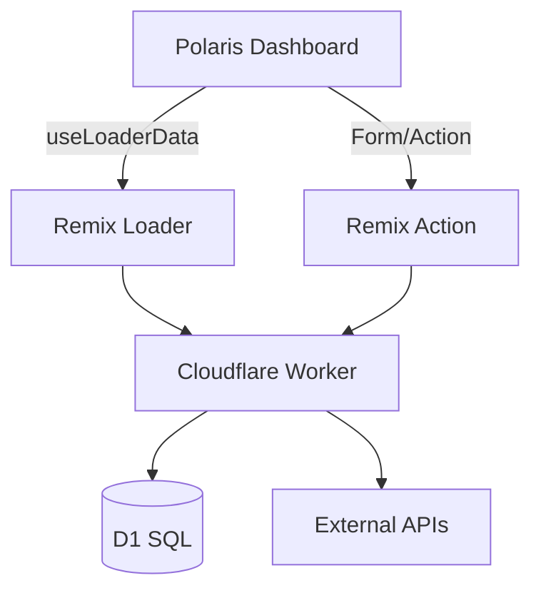

# WOOOD App Frontend Features

## 🎯 **Complete Shopify App Dashboard**

The WOOOD app now includes a comprehensive frontend interface that works with our unified D1 APIs, providing merchants with powerful management tools for their delivery date system, store locator, and experience center.

## 📊 **1. Health Dashboard**

**Location**: `app/components/HealthDashboard.tsx`

### Features:
- **Real-time System Status**: Shows overall health with color-coded badges
- **Service Monitoring**: D1 database and KV storage availability
- **Data Summary Cards**: 
  - Delivery cache entries count
  - Total products in catalog
  - Experience center featured products
- **Integration Status**: Store locator and experience center last run times
- **Error Reporting**: Displays specific error messages when integrations fail
- **Auto-refresh**: Manual refresh with loading states

### API Integration:
- Calls `/health` endpoint for unified system status
- Displays D1 data summary with `statusSummary()` method
- Shows real-time metrics and timestamps

---

## 🏪 **2. Store Locator Manager**

**Location**: `app/components/StoreLocatorManager.tsx`

### Features:
- **Dealer Management**: Add, edit, delete store locations
- **Smart Forms**: Country selection, address validation
- **Service Tags**: Multi-select services offered (Showroom, Delivery, Installation, etc.)
- **Data Table**: Sortable view of all store locations
- **Geographic Data**: Latitude/longitude support for mapping
- **Import/Export**: JSON data management
- **Bulk Operations**: Quick actions for data management

### Store Data Structure:
```typescript
interface DealerLocation {
  id: string;
  name: string;
  address: string;
  city: string;
  postalCode: string;
  country: string;
  latitude?: number;
  longitude?: number;
  phone?: string;
  email?: string;
  website?: string;
  services?: string[]; // JSON array stored as one string
}
```

### API Integration:
- Calls `/api/store-locator` for location search
- Saves data through unified D1 service
- Supports filtering by city and country

---

## 🏢 **3. Experience Center Manager**

**Location**: `app/components/ExperienceCenterManager.tsx`

### Features:
- **Product Catalog**: Complete product management interface
- **Advanced Filtering**: By category, availability, experience center status, price range
- **Quick Actions**: Toggle experience center featured status
- **Visual Product Cards**: Thumbnail images, titles, pricing
- **Shopify Integration**: Sync products from Shopify Admin API
- **Bulk Management**: Multi-product operations
- **Search & Filter**: Real-time product search with multiple filters

### Product Data Structure (Optimized for Performance):
```typescript
interface SimpleProduct {
  id: string;
  shopifyProductId: string;  // Link to Shopify
  title: string;
  category?: string;         // Simple flat category
  price?: number;            // EUR pricing
  availability: 'in_stock' | 'out_of_stock' | 'discontinued';
  imageUrl?: string;         // Single primary image
  isExperienceCenter: boolean; // Featured flag
}
```

### API Integration:
- Calls `/api/products` with filtering parameters
- Updates products through unified D1 service
- Supports Shopify product syncing

---

## 🚀 **4. Future Features Framework**

**Extensible Architecture**: The dashboard includes a "Future Features" tab that demonstrates the extensible framework ready for:

- **Analytics Dashboard**: Performance metrics and insights
- **Customer Management**: Order history and customer data
- **Inventory Sync**: Real-time stock management
- **Marketing Tools**: Campaign management and automation
- **Order Management**: Advanced order processing
- **Reporting**: Custom reports and exports

---

## 🎨 **UI/UX Design Principles**

### **Shopify Polaris Design System**
- Consistent with Shopify Admin UI patterns
- Responsive design for all screen sizes
- Accessible components with proper ARIA labels
- Professional merchant-focused interface

### **Component Architecture**
- **Reusable Components**: Modular design for easy maintenance
- **Type Safety**: Full TypeScript support throughout
- **Error Handling**: Graceful error states and loading indicators
- **Performance**: Optimized for fast loading and smooth interactions

### **Data Flow**
1. **Loader Functions**: Server-side data fetching in Remix routes
2. **API Integration**: Direct calls to unified Worker APIs
3. **State Management**: React hooks for component state
4. **Real-time Updates**: Manual refresh with loading states

---

## 🔧 UI → Worker Integration (At a Glance)



## 📱 **Mobile Responsive**

The interface is fully responsive and works seamlessly on:
- Desktop computers (primary use case)
- Tablets (optimized layouts)
- Mobile devices (condensed views)

---

## 🔧 **Technical Implementation**

### **File Structure**
```
app/
├── components/
│   ├── HealthDashboard.tsx       # System health monitoring
│   ├── StoreLocatorManager.tsx   # Store location management
│   └── ExperienceCenterManager.tsx # Product catalog management
├── routes/
│   └── app._index.tsx            # Main dashboard route
└── services/
    └── UnifiedD1Service.ts       # Backend D1 service
```

### **API Endpoints Used**
- `GET /health` - System health and D1 summary
- `GET /api/store-locator` - Store location search
- `GET /api/products` - Product catalog with filtering
- `GET /api/delivery-dates` - Delivery dates (checkout only)

### **Key Features**
- **Server-Side Rendering**: Fast initial page loads
- **Progressive Enhancement**: Works without JavaScript
- **Error Boundaries**: Graceful error handling
- **Loading States**: Clear feedback for all operations
- **Form Validation**: Client and server-side validation

---

## 🎯 **Merchant Benefits**

1. **Unified Management**: Single dashboard for all app features
2. **Real-time Monitoring**: Instant visibility into system health
3. **Easy Configuration**: Intuitive forms for store and product management
4. **Scalable Architecture**: Ready for future feature additions
5. **Professional Interface**: Matches Shopify Admin design standards
6. **Mobile Access**: Manage on any device

The frontend now provides a complete, professional interface that merchants can use to manage their delivery date system, store locations, and experience center products - all backed by our high-performance D1 unified database architecture! 🚀
# WOOOD App - Polaris Frontend Plan

## 🎯 Overview

Building a comprehensive Shopify Polaris frontend for the WOOOD app, starting with layout and health logs integration from the `/health` endpoint.

## 🏗️ Phase 1: Foundation & Layout

### 1.1 Main Dashboard Structure

```typescript
// app/routes/app._index.tsx
import { useLoaderData } from '@remix-run/react';
import { authenticate } from '~/shopify.server';
import {
  Page,
  Layout,
  Card,
  Tabs
} from '@shopify/polaris';
import { HealthDashboard } from '~/components/HealthDashboard';

export async function loader({ request }: LoaderFunctionArgs) {
  const { session } = await authenticate.admin(request);

  // Fetch health data from Workers API
  const healthResponse = await fetch(`${process.env.WORKERS_API_URL}/health`);
  const healthData = await healthResponse.json();

  return json({ shop: session.shop, healthData });
}

export default function DashboardPage() {
  const { shop, healthData } = useLoaderData<typeof loader>();
  const [activeTab, setActiveTab] = useState(0);

  const tabs = [
    { id: 'overview', content: 'System Overview' },
    { id: 'health', content: 'Health Logs' },
    { id: 'extensions', content: 'Extensions Status' },
    { id: 'integrations', content: 'External Integrations' },
  ];

  return (
    <Page
      title="WOOOD Dashboard"
      subtitle="Real-time system monitoring and configuration"
      primaryAction={{
        content: 'Refresh Status',
        onAction: () => window.location.reload(),
      }}
    >
      <Layout>
        <Layout.Section>
          <Card>
            <Tabs tabs={tabs} selected={activeTab} onSelect={setActiveTab}>
              <Card.Section>
                {activeTab === 0 && <SystemOverview healthData={healthData} />}
                {activeTab === 1 && <HealthLogs healthData={healthData} />}
                {activeTab === 2 && <ExtensionsStatus healthData={healthData} />}
                {activeTab === 3 && <ExternalIntegrations healthData={healthData} />}
              </Card.Section>
            </Tabs>
          </Card>
        </Layout.Section>
      </Layout>
    </Page>
  );
}
```

### 1.2 Health Data Structure

Based on the current `/health` endpoint:

```typescript
interface HealthData {
  status: 'healthy' | 'degraded' | 'unhealthy';
  timestamp: string;
  environment: 'production' | 'staging' | 'development';
  services: {
    kv: 'available' | 'unavailable';
    dutchNedApi: 'available' | 'unavailable' | 'unknown';
    shopifyApi: 'available' | 'unavailable';
  };
  integrations: {
    storeLocator: {
      lastRun: string;
      status: 'success' | 'error' | 'running';
      dealersProcessed: number;
    };
    experienceCenter: {
      lastRun: string;
      status: 'success' | 'error' | 'running';
      productsProcessed: number;
    };
  };
}
```

## 📊 Phase 2: Health Dashboard Component

### 2.1 System Overview Component

```typescript
// components/SystemOverview.tsx
import {
  Card,
  Stack,
  Badge,
  DisplayText,
  TextStyle,
  Heading,
  DescriptionList,
  Icon,
  Button,
  ButtonGroup
} from '@shopify/polaris';
import {
  CheckIcon,
  AlertTriangleIcon,
  ClockIcon,
  GlobeIcon
} from '@shopify/polaris-icons';

export function SystemOverview({ healthData, shop }: { healthData: HealthData; shop: string }) {
  const getStatusBadge = (status: string) => {
    const statusConfig = {
      healthy: { status: 'success', icon: CheckIcon },
      degraded: { status: 'warning', icon: AlertTriangleIcon },
      unhealthy: { status: 'critical', icon: AlertTriangleIcon },
    };

    const config = statusConfig[status] || statusConfig.unhealthy;

    return (
      <Badge status={config.status}>
        <Stack spacing="extraTight" alignment="center">
          <Icon source={config.icon} />
          <span>{status.charAt(0).toUpperCase() + status.slice(1)}</span>
        </Stack>
      </Badge>
    );
  };

  return (
    <Layout>
      {/* System Status */}
      <Layout.Section>
        <Card>
          <Card.Section>
            <Stack alignment="center" distribution="equalSpacing">
              <Stack vertical spacing="tight">
                <Heading>System Status</Heading>
                {getStatusBadge(healthData.status)}
                <TextStyle variation="subdued">
                  Last updated: {new Date(healthData.timestamp).toLocaleString()}
                </TextStyle>
              </Stack>

              <ButtonGroup>
                <Button icon={ClockIcon} onClick={() => window.location.reload()}>
                  Refresh
                </Button>
                <Button icon={GlobeIcon} onClick={() => window.open('/api/health', '_blank')}>
                  View Raw
                </Button>
              </ButtonGroup>
            </Stack>
          </Card.Section>
        </Card>
      </Layout.Section>

      {/* Service Status */}
      <Layout.Section>
        <Card title="Service Status">
          <Card.Section>
            <DescriptionList
              items={[
                {
                  term: 'Cloudflare KV Storage',
                  description: (
                    <Badge status={healthData.services.kv === 'available' ? 'success' : 'critical'}>
                      {healthData.services.kv === 'available' ? 'Available' : 'Unavailable'}
                    </Badge>
                  ),
                },
                {
                  term: 'DutchNed API',
                  description: (
                    <Badge status={healthData.services.dutchNedApi === 'available' ? 'success' : 'critical'}>
                      {healthData.services.dutchNedApi === 'available' ? 'Available' : 'Unavailable'}
                    </Badge>
                  ),
                },
                {
                  term: 'Shopify Admin API',
                  description: (
                    <Badge status={healthData.services.shopifyApi === 'available' ? 'success' : 'critical'}>
                      {healthData.services.shopifyApi === 'available' ? 'Available' : 'Unavailable'}
                    </Badge>
                  ),
                },
              ]}
            />
          </Card.Section>
        </Card>
      </Layout.Section>

      {/* Integration Status */}
      <Layout.Section>
        <Card title="External Integrations">
          <Card.Section>
            <Layout>
              <Layout.Section oneHalf>
                <Stack vertical spacing="tight">
                  <Heading element="h4">Store Locator</Heading>
                  <Stack alignment="center" spacing="tight">
                    <Badge status={healthData.integrations.storeLocator.status === 'success' ? 'success' : 'critical'}>
                      {healthData.integrations.storeLocator.status === 'success' ? 'Active' : 'Error'}
                    </Badge>
                    <TextStyle variation="subdued">
                      {healthData.integrations.storeLocator.dealersProcessed} dealers processed
                    </TextStyle>
                  </Stack>
                  <TextStyle variation="subdued">
                    Last run: {new Date(healthData.integrations.storeLocator.lastRun).toLocaleString()}
                  </TextStyle>
                </Stack>
              </Layout.Section>

              <Layout.Section oneHalf>
                <Stack vertical spacing="tight">
                  <Heading element="h4">Experience Center</Heading>
                  <Stack alignment="center" spacing="tight">
                    <Badge status={healthData.integrations.experienceCenter.status === 'success' ? 'success' : 'critical'}>
                      {healthData.integrations.experienceCenter.status === 'success' ? 'Active' : 'Error'}
                    </Badge>
                    <TextStyle variation="subdued">
                      {healthData.integrations.experienceCenter.productsProcessed} products processed
                    </TextStyle>
                  </Stack>
                  <TextStyle variation="subdued">
                    Last run: {new Date(healthData.integrations.experienceCenter.lastRun).toLocaleString()}
                  </TextStyle>
                </Stack>
              </Layout.Section>
            </Layout>
          </Card.Section>
        </Card>
      </Layout.Section>
    </Layout>
  );
}
```

### 2.2 Health Logs Component

```typescript
// components/HealthLogs.tsx
import {
  Card,
  DataTable,
  Badge,
  Filters,
  Pagination,
  Select,
  TextField,
  Button,
  Stack,
  Heading,
  TextStyle,
  Banner,
  Modal,
  Scrollable,
  EmptyState,
  Spinner
} from '@shopify/polaris';
import {
  SearchMinor,
  ExportMinor,
  FilterMajor
} from '@shopify/polaris-icons';

export function HealthLogs({ healthData }: { healthData: HealthData }) {
  const [healthLogs, setHealthLogs] = useState<HealthLog[]>([]);
  const [isLoading, setIsLoading] = useState(true);
  const [currentPage, setCurrentPage] = useState(1);
  const [statusFilter, setStatusFilter] = useState<string | null>(null);
  const [searchValue, setSearchValue] = useState('');
  const [showLogModal, setShowLogModal] = useState(false);
  const [selectedLog, setSelectedLog] = useState<HealthLog | null>(null);

  const itemsPerPage = 20;

  // Auto-refresh health logs every 30 seconds
  useEffect(() => {
    const fetchHealthLogs = async () => {
      try {
        const response = await fetch('/api/health/logs');
        const logs = await response.json();
        setHealthLogs(logs);
      } catch (error) {
        console.error('Failed to fetch health logs:', error);
      } finally {
        setIsLoading(false);
      }
    };

    fetchHealthLogs();
    const interval = setInterval(fetchHealthLogs, 30000);

    return () => clearInterval(interval);
  }, []);

  const filteredLogs = useMemo(() => {
    return healthLogs.filter(log => {
      const matchesStatus = !statusFilter || log.status === statusFilter;
      const matchesSearch = !searchValue ||
        log.message.toLowerCase().includes(searchValue.toLowerCase()) ||
        log.service.toLowerCase().includes(searchValue.toLowerCase());

      return matchesStatus && matchesSearch;
    });
  }, [healthLogs, statusFilter, searchValue]);

  const paginatedLogs = useMemo(() => {
    const startIndex = (currentPage - 1) * itemsPerPage;
    return filteredLogs.slice(startIndex, startIndex + itemsPerPage);
  }, [filteredLogs, currentPage]);

  const tableRows = paginatedLogs.map((log) => [
    new Date(log.timestamp).toLocaleString(),
    <Badge status={log.status === 'error' ? 'critical' : 'success'}>
      {log.status}
    </Badge>,
    log.service,
    log.message,
    <Button
      size="slim"
      onClick={() => {
        setSelectedLog(log);
        setShowLogModal(true);
      }}
    >
      View Details
    </Button>,
  ]);

  if (isLoading) {
    return (
      <Card>
        <Card.Section>
          <div style={{ textAlign: 'center', padding: '2rem' }}>
            <Spinner size="large" />
            <TextStyle variation="subdued">Loading health logs...</TextStyle>
          </div>
        </Card.Section>
      </Card>
    );
  }

  return (
    <>
      <Layout>
        <Layout.Section>
          <Card>
            <Card.Section>
              <Stack alignment="center" distribution="equalSpacing">
                <Heading>Health Logs</Heading>
                <ButtonGroup>
                  <Button
                    icon={ExportMinor}
                    onClick={() => exportHealthLogs(filteredLogs)}
                  >
                    Export Logs
                  </Button>
                  <Button onClick={() => window.location.reload()}>
                    Refresh
                  </Button>
                </ButtonGroup>
              </Stack>
            </Card.Section>

            <Card.Section>
              <Filters
                queryValue={searchValue}
                queryPlaceholder="Search logs..."
                filters={[
                  {
                    key: 'status',
                    label: 'Status',
                    filter: (
                      <Select
                        options={[
                          { label: 'All Statuses', value: '' },
                          { label: 'Success', value: 'success' },
                          { label: 'Error', value: 'error' },
                          { label: 'Warning', value: 'warning' },
                        ]}
                        value={statusFilter || ''}
                        onChange={setStatusFilter}
                      />
                    ),
                  },
                ]}
                onQueryChange={setSearchValue}
                onQueryClear={() => setSearchValue('')}
                onClearAll={() => {
                  setSearchValue('');
                  setStatusFilter('');
                }}
              />
            </Card.Section>

            {filteredLogs.length === 0 ? (
              <Card.Section>
                <EmptyState
                  heading="No health logs found"
                  image="https://cdn.shopify.com/s/files/1/0757/9955/files/empty-state.svg"
                >
                  <p>No logs match your current filters.</p>
                </EmptyState>
              </Card.Section>
            ) : (
              <>
                <DataTable
                  columnContentTypes={['text', 'text', 'text', 'text', 'text']}
                  headings={['Timestamp', 'Status', 'Service', 'Message', 'Actions']}
                  rows={tableRows}
                  sortable={[true, false, true, false, false]}
                  defaultSortDirection="descending"
                  initialSortColumnIndex={0}
                />

                {filteredLogs.length > itemsPerPage && (
                  <Card.Section>
                    <Stack alignment="center">
                      <Pagination
                        hasNext={currentPage * itemsPerPage < filteredLogs.length}
                        hasPrevious={currentPage > 1}
                        onNext={() => setCurrentPage(prev => prev + 1)}
                        onPrevious={() => setCurrentPage(prev => prev - 1)}
                      />
                      <TextStyle variation="subdued">
                        Page {currentPage} of {Math.ceil(filteredLogs.length / itemsPerPage)}
                      </TextStyle>
                    </Stack>
                  </Card.Section>
                )}
              </>
            )}
          </Card>
        </Layout.Section>
      </Layout>

      {selectedLog && (
        <Modal
          open={showLogModal}
          onClose={() => setShowLogModal(false)}
          title="Log Details"
          primaryAction={{
            content: 'Close',
            onAction: () => setShowLogModal(false),
          }}
        >
          <Modal.Section>
            <Scrollable style={{height: '400px'}}>
              <Stack vertical spacing="loose">
                <DescriptionList
                  items={[
                    { term: 'Timestamp', description: new Date(selectedLog.timestamp).toLocaleString() },
                    { term: 'Status', description: selectedLog.status },
                    { term: 'Service', description: selectedLog.service },
                    { term: 'Message', description: selectedLog.message },
                    { term: 'Duration', description: selectedLog.duration ? `${selectedLog.duration}ms` : 'N/A' },
                    { term: 'Environment', description: selectedLog.environment },
                  ]}
                />

                {selectedLog.details && (
                  <>
                    <Heading element="h4">Additional Details</Heading>
                    <pre style={{
                      backgroundColor: '#f6f6f7',
                      padding: '1rem',
                      borderRadius: '4px',
                      fontSize: '12px',
                      overflow: 'auto'
                    }}>
                      {JSON.stringify(selectedLog.details, null, 2)}
                    </pre>
                  </>
                )}
              </Stack>
            </Scrollable>
          </Modal.Section>
        </Modal>
      )}
    </>
  );
}
```

## 🔧 Phase 3: Implementation Steps

### Step 1: Setup Polaris App Structure
1. Create React app with Shopify Polaris
2. Set up routing with Remix
3. Configure authentication with App Bridge
4. Create basic layout components

### Step 2: Health Integration
1. Create health data fetching logic
2. Build system overview component
3. Implement real-time polling
4. Add error handling and loading states

### Step 3: Logs Interface
1. Create health logs component
2. Implement filtering and search
3. Add pagination and sorting
4. Build detailed log modal

### Step 4: Extensions & Integrations
1. Build extension status components
2. Create integration management interface
3. Add manual trigger functionality
4. Implement status monitoring

## 📊 Success Metrics

- **Page Load Time**: <2 seconds
- **Real-time Updates**: <5 second polling
- **Mobile Responsiveness**: 100% compatibility
- **Error Handling**: Graceful degradation
- **User Experience**: Intuitive navigation and clear status indicators

## 🚀 Next Steps

1. **Immediate**: Set up Polaris app foundation
2. **Week 1**: Implement health dashboard
3. **Week 2**: Add logs interface
4. **Week 3**: Build extensions management
5. **Week 4**: Complete integrations interface

This focused plan provides a clear roadmap for building a professional Polaris frontend that integrates seamlessly with the existing WOOOD Workers backend.
---
Merged plan on Sun Aug 10 03:28:32 UTC 2025
