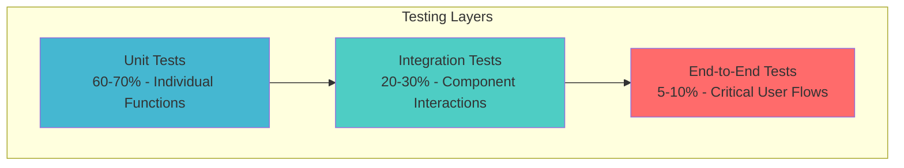

# WOOOD Delivery Date Management - Setup & Testing Guide

> Comprehensive setup and testing documentation for the WOOOD Delivery Date Picker system.

## 🚀 Production-Ready System Overview

The WOOOD Delivery Date Management system is a comprehensive solution for Shopify Plus stores that provides:

- **Delivery Date Selection** in checkout with real-time availability
- **Shipping Method Processing** with automated ERP integration
- **Order Webhook Processing** for seamless data transfer
- **OAuth Authentication** for secure Shopify integration
- **Production Monitoring** with alerts and analytics

## 📋 Prerequisites

### Required Accounts & Services

1. **Shopify Partner Account** with app development access
2. **Shopify Plus Store** (development store recommended for testing)
3. **Cloudflare Account** with Workers plan
4. **DutchNed API Access** with credentials

### Technical Requirements

- Node.js 18+ and npm/yarn
- Shopify CLI 3.0+
- Cloudflare Wrangler CLI
- Git for version control

---

## 🔧 Installation & Configuration

### Step 1: Clone and Setup Project

```bash
# Clone the repository
git clone [repository-url]
cd WOOOD_dutchned

# Install dependencies
npm install
```

### Step 2: Configuration Setup

**Modern Cloudflare Workers Configuration** - No `.env` files needed!

The system uses `workers/wrangler.toml` for environment variables and Cloudflare secrets for sensitive data.

1. **Verify wrangler.toml configuration:**
```toml
# workers/wrangler.toml (already configured)
[env.development]
vars = {
  ENVIRONMENT = "development",
  SHOPIFY_API_VERSION = "2025-04",
  DUTCHNED_API_URL = "https://eekhoorn-connector.dutchned.com/api/delivery-dates/available",
  SHOPIFY_APP_CLIENT_ID = "10a8926387f7ea9e09395b64b1f798c2"
}

[env.production]
vars = {
  ENVIRONMENT = "production",
  SHOPIFY_API_VERSION = "2025-04",
  DUTCHNED_API_URL = "https://eekhoorn-connector.dutchned.com/api/delivery-dates/available",
  SHOPIFY_APP_CLIENT_ID = "1c7701d2e09d4ede7616f35e13d472ef"
}
```

2. **No additional configuration files needed** - all settings are in `wrangler.toml`

### Step 3: Shopify Partner Dashboard Configuration

1. **Create new app** in Partner Dashboard:
   - App name: "WOOOD Delivery Date Management"
   - App type: "Custom app"
   - Distribution: "Private" (initially)

2. **Configure OAuth settings:**
   - App URL: `https://woood-production.leander-4e0.workers.dev`
   - Allowed redirection URLs: `https://woood-production.leander-4e0.workers.dev/auth/callback`
   - Requested scopes: `read_products,read_orders,write_order_metafields`

3. **Configure webhooks:**
   - Orders create: `https://woood-production.leander-4e0.workers.dev/api/webhooks/orders/created`
   - Orders paid: `https://woood-production.leander-4e0.workers.dev/api/webhooks/orders/paid`
   - Orders updated: `https://woood-production.leander-4e0.workers.dev/api/webhooks/orders/updated`

### Step 4: Deploy Cloudflare Workers

1. **Set up Wrangler:**
```bash
cd workers
npx wrangler auth login
```

2. **Set sensitive secrets via Cloudflare CLI:**
```bash
# Set secrets for development environment
npx wrangler secret put DUTCHNED_API_CREDENTIALS --env development
npx wrangler secret put SHOPIFY_APP_CLIENT_SECRET --env development
npx wrangler secret put SESSION_SECRET --env development
npx wrangler secret put WEBHOOK_SECRET --env development
npx wrangler secret put API_ENCRYPTION_KEY --env development

# Set secrets for production environment
npx wrangler secret put DUTCHNED_API_CREDENTIALS --env production
npx wrangler secret put SHOPIFY_APP_CLIENT_SECRET --env production
npx wrangler secret put SESSION_SECRET --env production
npx wrangler secret put WEBHOOK_SECRET --env production
npx wrangler secret put API_ENCRYPTION_KEY --env production
```

3. **Deploy Workers:**
```bash
# Deploy to development
npx wrangler deploy --env development

# Deploy to production
npx wrangler deploy --env production
```

### Step 5: Deploy Extensions

1. **Build and deploy extensions:**
```bash
# Return to project root and use modern npm scripts
yarn build:extensions
yarn extensions:deploy
```

2. **Verify extension configuration:**
```bash
yarn config:validate
```

---

## 🧪 Testing & Verification

### Testing Overview

The WOOOD Delivery Date Picker employs a multi-layered testing strategy ensuring reliability, performance, and security across all components. Our testing pyramid focuses on fast unit tests, critical integration tests, and essential end-to-end scenarios.

#### Testing Pyramid



#### Testing Principles

- **Fast Feedback**: Tests run in under 2 minutes for CI/CD
- **Reliable**: Tests are deterministic and environment-independent
- **Maintainable**: Tests serve as living documentation
- **Comprehensive**: Critical paths have 95%+ coverage
- **Isolated**: Tests don't depend on external services when possible

### Health Check

Test all systems are operational:
```bash
curl https://woood-production.leander-4e0.workers.dev/health
```

Expected response:
```json
{
  "status": "healthy",
  "version": "1.11.1",
  "environment": "production",
  "features": {
    "oauthIntegration": true,
    "dutchNedApi": true,
    "webhookProcessing": true
  }
}
```

### API Endpoints Test

Test delivery dates:
```bash
curl https://woood-production.leander-4e0.workers.dev/api/delivery-dates/available
```

Test with product data:
```bash
curl -X POST https://woood-production.leander-4e0.workers.dev/api/products/shipping-methods \
  -H "Content-Type: application/json" \
  -d '{"productIds": ["8542690115751"], "shopDomain": "your-store.myshopify.com"}'
```

### Frontend Admin Test

1. Access admin: `https://woood-production.leander-4e0.workers.dev/?shop=your-store.myshopify.com`
2. Complete OAuth flow
3. Run system tests from dashboard
4. Verify all indicators show green

---

## 🔬 Unit Testing

### Test Structure & Organization

```typescript
// Example test file structure
describe('DeliveryDatesService', () => {
  describe('getAvailableDates', () => {
    beforeEach(() => {
      // Setup test environment
      jest.clearAllMocks();
      mockEnv = createMockEnv();
    });

    it('should return available dates for valid postal code', async () => {
      // Arrange
      const postalCode = '1234AB';
      const mockDates = [
        { date: '2024-03-20', available: true },
        { date: '2024-03-21', available: true }
      ];

      mockDutchNedAPI.getDeliveryDates.mockResolvedValue(mockDates);

      // Act
      const result = await deliveryService.getAvailableDates(postalCode, 'NL', mockEnv);

      // Assert
      expect(result).toHaveLength(2);
      expect(result[0].date).toBe('2024-03-20');
      expect(mockDutchNedAPI.getDeliveryDates).toHaveBeenCalledWith(
        postalCode,
        expect.any(String),
        expect.any(String)
      );
    });

    it('should handle DutchNed API errors gracefully', async () => {
      // Arrange
      const postalCode = '1234AB';
      mockDutchNedAPI.getDeliveryDates.mockRejectedValue(
        new Error('External API unavailable')
      );

      // Act & Assert
      await expect(
        deliveryService.getAvailableDates(postalCode, 'NL', mockEnv)
      ).rejects.toThrow('External API unavailable');
    });
  });
});
```

### Testing Utilities

**Mock Environment**:
```typescript
export function createMockEnv(): MockEnv {
  return {
    WOOOD_KV: {
      get: jest.fn(),
      put: jest.fn(),
      delete: jest.fn(),
      list: jest.fn()
    },
    SHOPIFY_APP_CLIENT_ID: 'test_client_id',
    SHOPIFY_APP_CLIENT_SECRET: 'test_client_secret',
    DUTCHNED_API_CREDENTIALS: 'test_credentials',
    SESSION_SECRET: 'test_session_secret',
    WEBHOOK_SECRET: 'test_webhook_secret',
    API_ENCRYPTION_KEY: 'test_encryption_key'
  };
}
```

### Run Unit Tests

```bash
# Run all unit tests
yarn test:unit

# Run unit tests with coverage
yarn test:unit --coverage

# Run unit tests in watch mode
yarn test:watch
```

---

## 🔗 Integration Testing

### Service Integration Tests

```typescript
describe('Delivery Service Integration', () => {
  let deliveryService: DeliveryDatesService;
  let mockKV: MockKVNamespace;
  let mockDutchNedClient: MockDutchNedClient;

  beforeEach(() => {
    mockKV = new MockKVNamespace();
    mockDutchNedClient = new MockDutchNedClient();
    deliveryService = new DeliveryDatesService(mockDutchNedClient);
  });

  it('should cache delivery dates after API call', async () => {
    // Arrange
    const postalCode = '1234AB';
    const mockApiResponse = [
      TestDataFactory.createDeliveryDate({ date: '2024-03-20' }),
      TestDataFactory.createDeliveryDate({ date: '2024-03-21' })
    ];

    mockDutchNedClient.getDeliveryDates.mockResolvedValue(mockApiResponse);

    // Act
    const result = await deliveryService.getAvailableDates(postalCode, 'NL', mockEnv);

    // Assert
    expect(result).toEqual(mockApiResponse);
    expect(mockKV.put).toHaveBeenCalledWith(
      `delivery:${postalCode}:${getCurrentDate()}`,
      JSON.stringify(mockApiResponse),
      { expirationTtl: 1800 }
    );
  });
});
```

### Run Integration Tests

```bash
# Run integration tests
yarn test:integration

# Start test environment
yarn test:env:start

# Run integration tests with test environment
yarn test:integration:full
```

---

## 🎭 End-to-End Testing

### Playwright E2E Tests

```typescript
import { test, expect } from '@playwright/test';

test.describe('Delivery Date Picker E2E', () => {
  test.beforeEach(async ({ page }) => {
    // Setup test shop with app installed
    await setupTestShop();
    await page.goto('/checkout');
  });

  test('customer can select delivery date in checkout', async ({ page }) => {
    // Add product to cart
    await page.goto('/products/woood-dining-table');
    await page.click('[data-testid="add-to-cart"]');
    await page.goto('/checkout');

    // Fill shipping information
    await page.fill('[data-testid="shipping-postal-code"]', '1234AB');
    await page.fill('[data-testid="shipping-city"]', 'Amsterdam');

    // Wait for delivery date picker to load
    await page.waitForSelector('[data-testid="delivery-date-picker"]');

    // Select a delivery date
    const firstAvailableDate = page.locator('[data-testid="delivery-date-option"]').first();
    await firstAvailableDate.click();

    // Verify selection
    await expect(firstAvailableDate).toHaveClass(/selected/);

    // Complete checkout
    await page.fill('[data-testid="email"]', 'test@example.com');
    await page.click('[data-testid="complete-order"]');

    // Verify order completion
    await expect(page.locator('[data-testid="order-confirmation"]')).toBeVisible();
  });
});
```

### Run E2E Tests

```bash
# Install Playwright
npx playwright install

# Run E2E tests
yarn test:e2e

# Run E2E tests with UI
yarn test:e2e --ui
```

---

## 📊 Performance Testing

### Load Testing with Artillery

```yaml
# load-test.yml
config:
  target: 'https://woood-production.leander-4e0.workers.dev'
  phases:
    - duration: 60
      arrivalRate: 10
      name: "Warm up"
    - duration: 120
      arrivalRate: 50
      name: "Load test"
    - duration: 60
      arrivalRate: 100
      name: "Stress test"

scenarios:
  - name: "Delivery Dates API"
    weight: 70
    flow:
      - post:
          url: "/api/delivery-dates/available"
          headers:
            Content-Type: "application/json"
            Authorization: "Bearer {{ $randomString() }}"
          json:
            postal_code: "1234AB"
            country: "NL"
          expect:
            - statusCode: 200
            - hasProperty: "dates"
```

### Run Performance Tests

```bash
# Install Artillery
npm install -g artillery

# Run load tests
yarn test:load

# Run load tests with custom config
artillery run load-test.yml
```

---

## 🔒 Security Testing

### Authentication Security Tests

```typescript
describe('Security Tests', () => {
  test('should reject requests with invalid HMAC signatures', async () => {
    const response = await fetch('/api/webhooks/orders/paid', {
      method: 'POST',
      headers: {
        'X-Shopify-Topic': 'orders/paid',
        'X-Shopify-Hmac-Sha256': 'invalid_hmac',
        'Content-Type': 'application/json'
      },
      body: JSON.stringify({ id: 123, email: 'test@example.com' })
    });

    expect(response.status).toBe(401);
  });

  test('should sanitize XSS attempts in input', async () => {
    const maliciousInput = '<script>alert("xss")</script>';

    const response = await fetch('/api/delivery-dates/available', {
      method: 'POST',
      headers: {
        'Content-Type': 'application/json',
        'Authorization': 'Bearer valid_token'
      },
      body: JSON.stringify({
        postal_code: maliciousInput,
        country: 'NL'
      })
    });

    expect(response.status).toBe(400);
    const responseData = await response.json();
    expect(responseData.error).toContain('Invalid input');
  });
});
```

### Run Security Tests

```bash
# Run security-specific tests
yarn test:security

# Run all tests including security
yarn test:all
```

---

## 🏪 Store Integration

### Step 1: Install App on Development Store

1. **Generate installation URL:**
```
https://woood-production.leander-4e0.workers.dev/auth/start?shop=your-dev-store.myshopify.com
```

2. **Complete OAuth flow** and verify permissions

3. **Test extension in checkout:**
   - Add test product to cart
   - Proceed to checkout
   - Verify delivery date picker appears
   - Select date and complete order

### Step 2: Configure Test Data

Add test metafields for testing:

**ERP Delivery Time** (Product metafield):
```
Namespace: woood
Key: erp_levertijd
Value: 2025-15
```

**Shipping Method** (Product metafield):
```
Namespace: custom
Key: ShippingMethod2
Value: 31 - EXPEDITIE GESTOFFEERD
```

### Step 3: Test Complete Workflow

1. **Place test order** with delivery date selection
2. **Verify webhook processing** in Workers logs
3. **Check order metafields** created automatically
4. **Monitor admin dashboard** for metrics

---

## 🚀 Continuous Integration

### GitHub Actions Test Pipeline

```yaml
# .github/workflows/test.yml
name: Test Pipeline

on:
  push:
    branches: [ main, develop ]
  pull_request:
    branches: [ main ]

jobs:
  unit-tests:
    runs-on: ubuntu-latest
    steps:
      - uses: actions/checkout@v3
      - uses: actions/setup-node@v3
        with:
          node-version: '18'
          cache: 'yarn'

      - name: Install dependencies
        run: yarn install --frozen-lockfile

      - name: Run unit tests
        run: yarn test:unit --coverage

      - name: Upload coverage
        uses: codecov/codecov-action@v3

  integration-tests:
    runs-on: ubuntu-latest
    needs: unit-tests
    steps:
      - uses: actions/checkout@v3
      - uses: actions/setup-node@v3
        with:
          node-version: '18'
          cache: 'yarn'

      - name: Install dependencies
        run: yarn install --frozen-lockfile

      - name: Start test environment
        run: yarn test:env:start

      - name: Run integration tests
        run: yarn test:integration
        env:
          TEST_SHOPIFY_CLIENT_ID: ${{ secrets.TEST_SHOPIFY_CLIENT_ID }}
          TEST_SHOPIFY_CLIENT_SECRET: ${{ secrets.TEST_SHOPIFY_CLIENT_SECRET }}

  e2e-tests:
    runs-on: ubuntu-latest
    needs: integration-tests
    steps:
      - uses: actions/checkout@v3
      - uses: actions/setup-node@v3
        with:
          node-version: '18'
          cache: 'yarn'

      - name: Install dependencies
        run: yarn install --frozen-lockfile

      - name: Install Playwright
        run: npx playwright install

      - name: Run E2E tests
        run: yarn test:e2e
        env:
          E2E_BASE_URL: ${{ secrets.E2E_BASE_URL }}
```

### All Test Commands

```json
{
  "scripts": {
    "test": "jest",
    "test:unit": "jest --testPathPattern=unit",
    "test:integration": "jest --testPathPattern=integration",
    "test:e2e": "playwright test",
    "test:watch": "jest --watch",
    "test:coverage": "jest --coverage",
    "test:load": "artillery run load-test.yml",
    "test:security": "jest --testPathPattern=security",
    "test:all": "yarn test:unit && yarn test:integration && yarn test:e2e",
    "test:env:start": "docker-compose up -d",
    "test:env:stop": "docker-compose down"
  }
}
```

---

## 📊 Monitoring & Maintenance

### Production Monitoring

The system includes built-in monitoring:

- **Health checks** every minute
- **Error rate tracking** with alerts
- **Performance metrics** and analytics
- **Webhook processing status**

### Alert Thresholds

- Response time > 3 seconds
- Error rate > 10%
- Uptime < 99.5%

### Log Access

View real-time logs using modern npm scripts:
```bash
# Development logs
yarn logs:dev

# Production logs
yarn logs:production
```

### KV Storage Management

Monitor storage usage:
```bash
cd workers
npx wrangler kv:key list --binding=WOOOD_KV --env production
```

---

## 🔒 Security Considerations

### Data Protection

- All API calls use HTTPS encryption
- OAuth tokens stored securely in Cloudflare KV
- Webhook signatures verified for authenticity
- CORS properly configured for checkout domains

### Access Control

- Admin dashboard requires Shopify OAuth
- API endpoints validate shop domains
- Webhook endpoints require valid signatures
- Environment secrets properly isolated

---

## 🚀 Going Live

### Pre-Launch Checklist

- [ ] All environment variables configured
- [ ] OAuth flow tested on development store
- [ ] Extension working in checkout
- [ ] Webhooks processing orders correctly
- [ ] Monitoring dashboard operational
- [ ] DutchNed API integration verified
- [ ] Error handling tested
- [ ] Unit tests passing (95%+ coverage)
- [ ] Integration tests passing
- [ ] E2E tests passing
- [ ] Performance tests meet thresholds
- [ ] Security tests passing

### Launch Steps

1. **Update Partner Dashboard** to public distribution
2. **Set production CORS origins** for live stores
3. **Configure production webhooks**
4. **Enable monitoring alerts**
5. **Provide store owners with installation URL**

### Post-Launch Monitoring

Monitor these metrics daily:
- System health and uptime
- Order processing success rate
- Extension usage analytics
- API response times
- Error rates and types
- Test suite status

---

## 🆘 Troubleshooting

### Common Issues

**Extension not loading:**
- Check CORS configuration
- Verify API endpoint accessibility
- Review browser console for errors
- Run E2E tests to verify checkout flow

**Webhooks not processing:**
- Verify webhook URL configuration
- Check signature validation
- Review Workers logs for errors
- Run webhook integration tests

**OAuth failures:**
- Confirm client ID/secret configuration
- Check redirect URL matches exactly
- Verify app URL accessibility
- Run OAuth integration tests

**Test failures:**
- Check test environment setup
- Verify test data and fixtures
- Review CI/CD pipeline logs
- Run tests locally to isolate issues

### Support Contacts

- **Technical Issues:** Review Workers logs and health dashboard
- **API Problems:** Check DutchNed API status
- **Extension Issues:** Test in Shopify development environment
- **Test Issues:** Review test logs and CI/CD pipeline

---

## 📚 Additional Resources

- [Shopify App Development Guide](https://shopify.dev/apps)
- [Cloudflare Workers Documentation](https://developers.cloudflare.com/workers/)
- [Shopify Extensions Guide](https://shopify.dev/apps/checkout)
- [Jest Testing Framework](https://jestjs.io/)
- [Playwright E2E Testing](https://playwright.dev/)
- [Artillery Load Testing](https://artillery.io/)

---

**Version:** 1.11.1
**Last Updated:** January 2025
**Status:** Production Ready ✅

**🧪 Testing Note**: This comprehensive setup and testing guide ensures system reliability, performance, and security while maintaining fast feedback loops for developers.