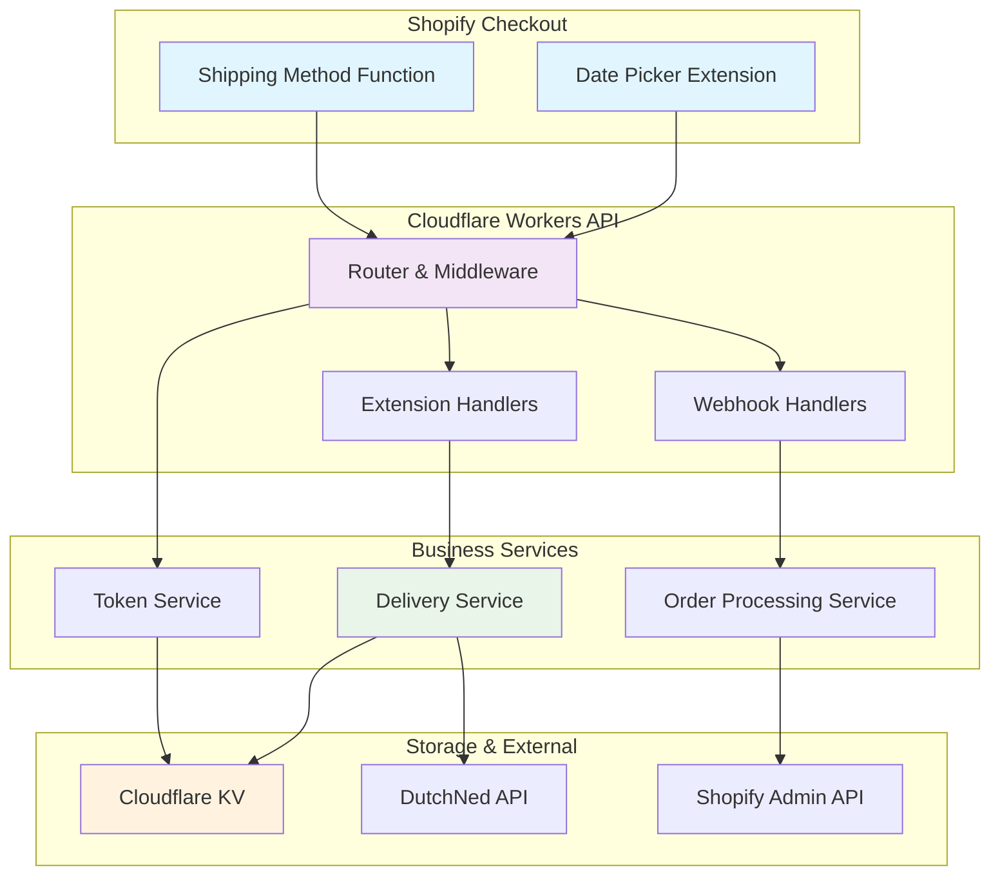

# System Components Architecture

> Detailed breakdown of the streamlined extension + workers architecture components.

## 🏗️ Component Overview

The WOOOD Delivery Date Picker uses a simplified architecture with Shopify Extensions communicating directly with Cloudflare Workers for optimal performance and maintainability.



## 🎯 Shopify Extension Components

### Date Picker Extension

**Location**: `extensions/date-picker/`

**Purpose**: Provides delivery date selection interface in Shopify checkout

**Technology Stack**:
- **React 18** with TypeScript
- **React Query** for data fetching and caching
- **Shopify Checkout Extensions API**
- **Vite** for build system

**Key Files**:
```typescript
// Main extension entry point
src/index.tsx

// React Query hook for delivery dates
src/hooks/useDeliveryDates.ts

// Workers API client
src/services/apiClient.ts

// Error boundary for robustness
src/components/ErrorBoundary.tsx
```

**Component Structure**:
```typescript
interface DeliveryDatePickerProps {
  postalCode: string;
  country: string;
  onDateSelect: (date: string) => void;
}

export function DeliveryDatePicker({
  postalCode,
  country,
  onDateSelect
}: DeliveryDatePickerProps) {
  const { data: deliveryDates, isLoading } = useDeliveryDates(postalCode, country);
  
  return (
    <BlockStack spacing="base">
      {deliveryDates?.map(date => (
        <Button key={date.date} onPress={() => onDateSelect(date.date)}>
          {date.displayName}
        </Button>
      ))}
    </BlockStack>
  );
}
```

### Shipping Method Function

**Location**: `extensions/shipping-method/`

**Purpose**: Filters and customizes shipping rates based on product metafields

**Technology Stack**:
- **TypeScript** for business logic
- **GraphQL** for Shopify API interaction
- **Shopify Functions API**

**Key Implementation**:
```typescript
export default function shippingMethodFilter(input: ShippingMethodFilterInput) {
  const cartItems = input.cart.lines;
  let highestPriorityMethod = null;

  // Process each cart item
  for (const item of cartItems) {
    const metafield = item.merchandise.product.metafields
      .find(m => m.namespace === 'custom' && m.key === 'ShippingMethod2');

    if (metafield?.value) {
      const shippingMethod = parseShippingMethod(metafield.value);
      if (!highestPriorityMethod || shippingMethod.priority > highestPriorityMethod.priority) {
        highestPriorityMethod = shippingMethod;
      }
    }
  }

  return {
    operations: [{
      rename: {
        handle: 'woood-standard',
        title: highestPriorityMethod?.name || 'WOOOD Standard'
      }
    }]
  };
}
```

## ⚡ Cloudflare Workers API Components

### Router & Middleware

**Location**: `workers/src/index.ts`

**Purpose**: Main request routing and middleware processing

**Key Features**:
- **itty-router**: Modern routing framework
- **Middleware Chain**: Authentication, validation, CORS
- **Error Handling**: Comprehensive error management
- **Performance Monitoring**: Request timing and metrics

**Router Implementation**:
```typescript
import { Router } from 'itty-router';
import { corsHeaders, authMiddleware, validationMiddleware } from './middleware';

const router = Router();

// Extension endpoints
router.get('/api/delivery-dates/available', authMiddleware, handleDeliveryDates);
router.post('/api/products/shipping-methods', authMiddleware, handleShippingMethods);

// Webhook endpoints  
router.post('/api/webhooks/orders/paid', webhookAuthMiddleware, handleOrderPaid);
router.post('/api/webhooks/orders/created', webhookAuthMiddleware, handleOrderCreated);

// System endpoints
router.get('/health', handleHealth);
router.get('/auth/start', handleOAuthStart);
router.get('/auth/callback', handleOAuthCallback);

export default {
  fetch: router.handle,
};
```

### Extension Handlers

**Location**: `workers/src/handlers/deliveryDates.ts`, `workers/src/handlers/shippingMethods.ts`

**Purpose**: API endpoints specifically for checkout extensions

**Delivery Dates Handler**:
```typescript
export async function handleDeliveryDates(request: Request, env: Env): Promise<Response> {
  const url = new URL(request.url);
  const postalCode = url.searchParams.get('postal_code');
  const country = url.searchParams.get('country') || 'NL';

  // Validate inputs
  if (!postalCode || !validatePostalCode(postalCode)) {
    return new Response(JSON.stringify({
      success: false,
      error: 'Valid postal code required'
    }), { status: 400 });
  }

  // Get delivery dates from service
  const deliveryService = new DeliveryDatesService();
  const dates = await deliveryService.getAvailableDates(postalCode, country, env);

  return new Response(JSON.stringify({
    success: true,
    dates: dates,
    cached: dates.length > 0
  }), {
    headers: { 'Content-Type': 'application/json' }
  });
}
```

### Webhook Handlers

**Location**: `workers/src/handlers/orderWebhooks.ts`

**Purpose**: Process Shopify order webhooks for automated metafield creation

**Order Processing Pipeline**:
```typescript
export async function handleOrderPaid(request: Request, env: Env): Promise<Response> {
  // Validate webhook signature
  const signatureValid = await validateWebhookSignature(request, env);
  if (!signatureValid) {
    return new Response('Unauthorized', { status: 401 });
  }

  // Parse order data
  const orderData = await request.json() as ShopifyOrder;
  
  // Process note_attributes → metafields
  const processingService = new OrderProcessingService();
  const result = await processingService.processOrder(orderData, env);

  if (result.success) {
    return new Response(JSON.stringify({
      success: true,
      metafieldsCreated: result.metafieldsCreated,
      processingTime: result.processingTime
    }));
  } else {
    return new Response(JSON.stringify({
      success: false,
      error: result.error
    }), { status: 500 });
  }
}
```

## 🔧 Business Service Components

### Delivery Dates Service

**Location**: `workers/src/services/deliveryDatesService.ts`

**Purpose**: Core business logic for delivery date calculation and caching

**Key Methods**:
```typescript
class DeliveryDatesService {
  async getAvailableDates(
    postalCode: string,
    country: string = 'NL',
    env: Env
  ): Promise<DeliveryDate[]> {
    // Check cache first
    const cacheKey = `delivery:${postalCode}:${country}`;
    const cached = await env.WOOOD_KV.get(cacheKey, 'json');
    
    if (cached) {
      return cached as DeliveryDate[];
    }

    // Fetch from DutchNed API
    const dutchNedClient = new DutchNedClient(env);
    const dates = await dutchNedClient.getDeliveryDates(postalCode, country);

    // Cache for 30 minutes
    await env.WOOOD_KV.put(cacheKey, JSON.stringify(dates), { 
      expirationTtl: 1800 
    });

    return dates;
  }

  async validateDeliveryDate(
    date: string,
    postalCode: string,
    env: Env
  ): Promise<boolean> {
    const availableDates = await this.getAvailableDates(postalCode, 'NL', env);
    return availableDates.some(d => d.date === date && d.available);
  }
}
```

### Order Processing Service

**Location**: `workers/src/services/orderProcessingPipeline.ts`

**Purpose**: Transforms note_attributes to structured metafields

**Processing Pipeline**:
```typescript
class OrderProcessingService {
  async processOrder(orderData: ShopifyOrder, env: Env): Promise<ProcessingResult> {
    const startTime = Date.now();

    try {
      // Extract note_attributes
      const noteAttributes = orderData.note_attributes || [];
      
      // Transform to metafields
      const metafields = this.transformNoteAttributesToMetafields(noteAttributes);
      
      if (metafields.length === 0) {
        return { success: true, metafieldsCreated: 0, processingTime: Date.now() - startTime };
      }

      // Create metafields via Shopify Admin API
      const metafieldService = new MetafieldService();
      const results = await metafieldService.createOrderMetafields(
        orderData.id,
        metafields,
        env
      );

      return {
        success: true,
        metafieldsCreated: results.length,
        processingTime: Date.now() - startTime
      };
    } catch (error) {
      return {
        success: false,
        error: error.message,
        processingTime: Date.now() - startTime
      };
    }
  }

  private transformNoteAttributesToMetafields(noteAttributes: NoteAttribute[]): Metafield[] {
    const metafields: Metafield[] = [];

    for (const attr of noteAttributes) {
      switch (attr.name) {
        case 'delivery_date':
          metafields.push({
            namespace: 'woood_delivery',
            key: 'selected_date',
            value: attr.value,
            type: 'date'
          });
          break;
        case 'shipping_method':
          metafields.push({
            namespace: 'woood_delivery',
            key: 'shipping_method',
            value: attr.value,
            type: 'single_line_text_field'
          });
          break;
      }
    }

    return metafields;
  }
}
```

### Simple Token Service

**Location**: `workers/src/services/simpleTokenService.ts`

**Purpose**: Lightweight OAuth token storage and management

**Token Operations**:
```typescript
class SimpleTokenService {
  async storeToken(shop: string, token: ShopifyToken, env: Env): Promise<void> {
    const tokenKey = `shop_token:${shop}`;
    const tokenData = {
      accessToken: token.access_token,
      scope: token.scope,
      expiresAt: Date.now() + (token.expires_in * 1000),
      createdAt: Date.now()
    };

    await env.WOOOD_KV.put(tokenKey, JSON.stringify(tokenData), {
      expirationTtl: token.expires_in || 86400 // 24 hours default
    });
  }

  async getToken(shop: string, env: Env): Promise<ShopifyToken | null> {
    const tokenKey = `shop_token:${shop}`;
    const tokenData = await env.WOOOD_KV.get(tokenKey, 'json');

    if (!tokenData) {
      return null;
    }

    // Check if token is expired
    if (tokenData.expiresAt && Date.now() > tokenData.expiresAt) {
      await env.WOOOD_KV.delete(tokenKey);
      return null;
    }

    return tokenData as ShopifyToken;
  }

  async deleteToken(shop: string, env: Env): Promise<void> {
    const tokenKey = `shop_token:${shop}`;
    await env.WOOOD_KV.delete(tokenKey);
  }
}
```

## 💾 Storage & External Components

### Cloudflare KV Storage

**Purpose**: High-performance edge storage for caching and tokens

**Storage Patterns**:
```typescript
// Token storage with automatic expiration
const tokenKey = `shop_token:${shop}`;
await env.WOOOD_KV.put(tokenKey, JSON.stringify(tokenData), { 
  expirationTtl: 86400 
});

// Delivery date cache with short TTL
const deliveryKey = `delivery:${postalCode}:${date}`;
await env.WOOOD_KV.put(deliveryKey, JSON.stringify(dates), { 
  expirationTtl: 1800 
});

// Processing status tracking
const statusKey = `order_processing:${orderId}`;
await env.WOOOD_KV.put(statusKey, JSON.stringify(status), { 
  expirationTtl: 3600 
});
```

### DutchNed API Integration

**Location**: `workers/src/api/dutchNedClient.ts`

**Purpose**: External API client for delivery date calculations

**Client Implementation**:
```typescript
class DutchNedClient {
  constructor(private env: Env) {}

  async getDeliveryDates(postalCode: string, country: string): Promise<DeliveryDate[]> {
    const response = await fetch(this.env.DUTCHNED_API_URL, {
      method: 'POST',
      headers: {
        'Authorization': `Basic ${this.env.DUTCHNED_API_CREDENTIALS}`,
        'Content-Type': 'application/json'
      },
      body: JSON.stringify({
        postalCode,
        country,
        requestedDates: 14
      })
    });

    if (!response.ok) {
      throw new Error(`DutchNed API error: ${response.status}`);
    }

    const data = await response.json();
    return this.transformDutchNedResponse(data);
  }

  private transformDutchNedResponse(data: any): DeliveryDate[] {
    return data.availableDates.map(date => ({
      date: date.date,
      available: date.available,
      displayName: this.formatDateForDisplay(date.date, 'nl-NL')
    }));
  }
}
```

### Shopify Admin API Integration

**Purpose**: Metafield management and order processing

**GraphQL Operations**:
```typescript
const CREATE_ORDER_METAFIELD = `
  mutation CreateOrderMetafield($orderId: ID!, $metafield: MetafieldInput!) {
    orderUpdate(input: {
      id: $orderId,
      metafields: [$metafield]
    }) {
      order {
        id
        metafields(first: 10) {
          edges {
            node {
              id
              namespace
              key
              value
            }
          }
        }
      }
      userErrors {
        field
        message
      }
    }
  }
`;
```

## 🔄 Data Flow Summary

1. **Extension Request**: Customer interaction triggers API call to Workers
2. **Authentication**: Simple token validation for shop context
3. **Business Logic**: Service processes request with external API calls
4. **Caching**: Results cached in KV for performance
5. **Response**: Structured data returned to extension

6. **Order Creation**: Shopify creates order with note_attributes
7. **Webhook Trigger**: Order webhook sent to Workers
8. **Processing**: note_attributes transformed to metafields
9. **Fulfillment**: Order ready with structured delivery data

---

**Components Version**: 2.0 (Streamlined Extension + Workers)
**Last Updated**: January 2025
**Status**: 🚀 Production Ready - Simplified Architecture
